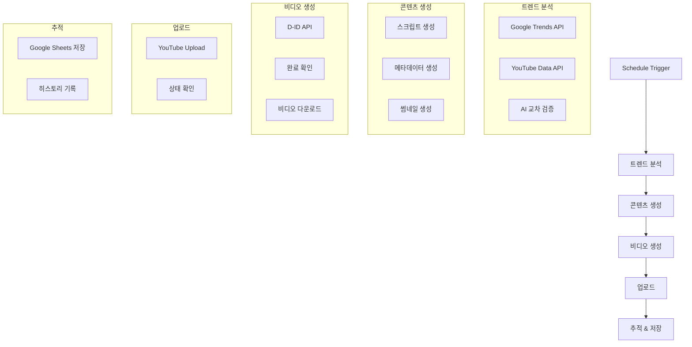

# N8N 워크플로우 문서화

> 📅 생성일: 2025-11-22  
> 📸 기반 자료: 30개 스크린샷 분석  
> 🎯 목적: YouTube Shorts 자동화 워크플로우

---

## 📋 목차

1. [워크플로우 개요](#워크플로우-개요)
2. [전체 워크플로우 구조](#전체-워크플로우-구조)
3. [노드별 상세 설정](#노드별-상세-설정)
4. [데이터 흐름](#데이터-흐름)
5. [주요 기능](#주요-기능)

---

## 워크플로우 개요

### 목적
유튜브 쇼츠용 시니어 건강 콘텐츠를 자동으로 생성하고 업로드하는 N8N 워크플로우

### 주요 기능
- 🔍 **트렌드 분석**: Google Trends + YouTube API를 통한 이중 소스 분석
- 🤖 **AI 콘텐츠 생성**: OpenAI GPT를 활용한 스크립트 및 메타데이터 생성
- 🎬 **비디오 제작**: D-ID API를 통한 AI 아바타 비디오 생성
- 📤 **자동 업로드**: YouTube API를 통한 자동 업로드
- 💾 **상태 관리**: Google Sheets를 통한 콘텐츠 추적 및 히스토리 관리

---

## 전체 워크플로우 구조



---

## 노드별 상세 설정

### 1️⃣ Schedule Trigger (스케줄 트리거)

**노드 타입**: `n8n-nodes-base.scheduleTrigger`

**설정값**:
- **Rule**: 매일 오전 9시 실행
- **Timezone**: Asia/Seoul (KST)
- **Mode**: Custom

```json
{
  "rule": {
    "interval": [{
      "field": "cronExpression",
      "expression": "0 9 * * *"
    }]
  },
  "timezone": "Asia/Seoul"
}
```

**용도**: 워크플로우를 매일 정해진 시간에 자동 실행

---

### 2️⃣ Google Trends Analysis (구글 트렌드 분석)

**노드 타입**: `n8n-nodes-base.httpRequest`

**주요 설정**:
- **Method**: GET
- **URL**: Google Trends API endpoint
- **Query Parameters**:
  - `geo`: KR (대한민국)
  - `category`: Health (건강)
  - `time`: now 7-d (최근 7일)

**응답 데이터**:
```json
{
  "trends": [
    {
      "keyword": "시니어 건강",
      "interest": 85,
      "related_queries": [...]
    }
  ]
}
```

---

### 3️⃣ YouTube Trends Fetcher (유튜브 트렌드 수집)

**노드 타입**: `n8n-nodes-base.youTube`

**설정**:
- **Resource**: Search
- **Operation**: List
- **Options**:
  - `q`: 시니어 건강, 노인 운동
  - `type`: video
  - `order`: viewCount
  - `publishedAfter`: 최근 7일
  - `maxResults`: 10
  - `videoDuration`: short (쇼츠)

**추출 데이터**:
- 비디오 제목
- 조회수
- 좋아요 수
- 댓글 수
- 키워드 태그

---

### 4️⃣ AI Cross-Validation (AI 교차 검증)

**노드 타입**: `n8n-nodes-base.openAi`

**모델**: `gpt-4-turbo`

**프롬프트 구조**:
```
당신은 시니어 건강 콘텐츠 전문가입니다.

다음 두 소스의 트렌드 데이터를 분석하세요:

Google Trends: {{ $json.googleTrends }}
YouTube Trends: {{ $json.youtubeTrends }}

다음 조건을 만족하는 최적의 주제를 선정하세요:
1. 60세+ 시니어에게 실질적으로 도움이 되는 내용
2. 쇼츠 형식(60초 이내)에 적합
3. 시각적으로 표현 가능한 운동/건강법
4. 안전하고 검증된 정보

JSON 형식으로 응답하세요:
{
  "topic": "선정된 주제",
  "reason": "선정 이유",
  "keywords": ["키워드1", "키워드2"],
  "safety_check": true/false
}
```

---

### 5️⃣ Script Generator (스크립트 생성기)

**노드 타입**: `n8n-nodes-base.openAi`

**모델**: `gpt-4-turbo`

**페르소나**: 보람 (따뜻하고 친근한 시니어 건강 가이드)

**프롬프트**:
```
페르소나: 보람 - 60대 여성, 전직 간호사, 따뜻하고 친근한 말투

주제: {{ $json.topic }}

60초 쇼츠용 스크립트를 작성하세요:

구조:
[00-10초] 후킹: 시선을 사로잡는 질문/문제 제기
[10-40초] 본론: 구체적인 방법 3가지 (각 10초)
[40-55초] 팁: 주의사항 또는 추가 팁
[55-60초] 클로징: 행동 유도 및 인사

말투:
- 존댓말 사용
- 따뜻하고 격려하는 톤
- 전문용어는 쉽게 풀어서 설명
- "우리 함께 해봐요" 스타일

JSON 응답:
{
  "script": "전체 스크립트",
  "sections": {
    "hook": "...",
    "main": ["방법1", "방법2", "방법3"],
    "tip": "...",
    "closing": "..."
  },
  "estimated_duration": 60
}
```

---

### 6️⃣ Metadata Generator (메타데이터 생성기)

**노드 타입**: `n8n-nodes-base.openAi`

**목적**: 제목, 설명, 태그, 해시태그 생성

**프롬프트**:
```
주제: {{ $json.topic }}
스크립트: {{ $json.script }}

유튜브 쇼츠용 최적화된 메타데이터를 생성하세요:

제목 요구사항:
- 40자 이내
- 숫자 포함 (예: 3가지 방법)
- 감탄사 또는 이모지 활용
- 클릭을 유도하는 후킹 요소

설명 요구사항:
- 3-5줄
- 핵심 내용 요약
- 행동 유도 (구독, 좋아요)
- 관련 영상 링크 가능

태그:
- 15-20개
- 관련성 높은 순서로 정렬
- 롱테일 키워드 포함

해시태그:
- 3-5개
- 트렌딩 해시태그 우선

JSON 응답:
{
  "title": "제목",
  "description": "설명",
  "tags": ["태그1", "태그2", ...],
  "hashtags": ["#해시태그1", "#해시태그2", ...]
}
```

---

### 7️⃣ Thumbnail Image Generator (썸네일 생성기)

**노드 타입**: `n8n-nodes-base.openAi` (DALL-E 3)

**설정**:
- **Model**: dall-e-3
- **Size**: 1024x1024 (이후 1080x1920으로 리사이즈)
- **Quality**: hd
- **Style**: natural

**프롬프트 템플릿**:
```
Create a warm and inviting thumbnail for a YouTube Short about: {{ $json.topic }}

Style:
- Soft, warm lighting
- Friendly senior woman (60s) doing the health activity
- Clean, uncluttered background
- Professional but approachable

Colors:
- Pastel tones (soft pink, light blue, cream)
- Avoid harsh contrasts
- Warm and comforting palette

Composition:
- Portrait orientation (9:16 ratio)
- Subject centered
- Clear focal point
- Large, readable text space

Text overlay (Korean):
Main: "{{ $json.title }}"
Font: Bold, sans-serif, high contrast

Extra elements:
- Small health icon (heart, leaf)
- Subtle gradient backdrop
```

---

### 8️⃣ D-ID Video Creator (AI 비디오 생성)

**노드 타입**: `n8n-nodes-base.httpRequest`

**API**: D-ID API v1

**Endpoint**: `POST /talks`

**요청 바디**:
```json
{
  "script": {
    "type": "text",
    "input": "{{ $json.script }}",
    "provider": {
      "type": "microsoft",
      "voice_id": "ko-KR-SunHiNeural"
    }
  },
  "source_url": "{{ $json.presenterId }}",
  "config": {
    "fluent": true,
    "pad_audio": 0,
    "stitch": true,
    "result_format": "mp4"
  },
  "driver_url": "bank://lively"
}
```

**응답**:
```json
{
  "id": "tlk_xxxxxxxxxxxx",
  "status": "created",
  "created_at": "2025-11-22T02:21:05.000Z"
}
```

---

### 9️⃣ D-ID Status Checker (비디오 생성 상태 확인)

**노드 타입**: `n8n-nodes-base.httpRequest`

**Method**: GET

**URL**: `https://api.d-id.com/talks/{{ $json.talkId }}`

**Loop Configuration**:
- **Maximum Retries**: 30
- **Retry Interval**: 10초
- **Success Condition**: `status === "done"`

**응답 (완료 시)**:
```json
{
  "id": "tlk_xxxxxxxxxxxx",
  "status": "done",
  "result_url": "https://d-id-talks-prod.s3.amazonaws.com/...",
  "duration": 58.5
}
```

---

### 🔟 Video Downloader (비디오 다운로드)

**노드 타입**: `n8n-nodes-base.httpRequest`

**설정**:
- **Method**: GET
- **URL**: `{{ $json.result_url }}`
- **Response Format**: File (Binary)
- **Download File Name**: `shorts_{{ $now.toFormat('yyyyMMdd_HHmmss') }}.mp4`

**저장 경로**: `/tmp/n8n/videos/`

---

### 1️⃣1️⃣ YouTube Uploader (유튜브 업로드)

**노드 타입**: `n8n-nodes-base.youTube`

**Resource**: Video

**Operation**: Upload

**주요 설정**:
```json
{
  "title": "{{ $json.metadata.title }}",
  "description": "{{ $json.metadata.description }}",
  "tags": "{{ $json.metadata.tags }}",
  "categoryId": "22",
  "privacyStatus": "public",
  "madeForKids": false,
  "thumbnail": "{{ $json.thumbnailUrl }}",
  "binaryData": true,
  "binaryPropertyName": "data"
}
```

**카테고리 ID**:
- 22 = People & Blogs
- Alternative: 26 = Howto & Style

---

### 1️⃣2️⃣ Google Sheets Logger (구글 시트 기록)

**노드 타입**: `n8n-nodes-base.googleSheets`

**Operation**: Append Row

**Spreadsheet**: `YouTube Shorts Tracker`

**Sheet Name**: `콘텐츠 히스토리`

**데이터 구조**:
| 날짜 | 주제 | 제목 | 비디오 ID | 조회수 | 좋아요 | 댓글 | 상태 |
|------|------|------|-----------|--------|--------|------|------|
| 2025-11-22 | 시니어 스트레칭 | ... | abc123 | 0 | 0 | 0 | Published |

**추가 컬럼** (메타정보):
- 트렌드 소스
- AI 모델 버전
- 생성 시간
- 업로드 시간

---

## 데이터 흐름

### Phase 1: 트렌드 수집 및 분석
```
Schedule Trigger
  ↓
[Google Trends API] → Trend Data 1
[YouTube Data API] → Trend Data 2
  ↓
[Merge + AI Analysis] → Selected Topic
```

### Phase 2: 콘텐츠 생성
```
Selected Topic
  ↓
[GPT-4: Script] → Full Script (60s)
  ↓
[GPT-4: Metadata] → Title, Description, Tags
  ↓
[DALL-E 3: Image] → Thumbnail PNG
```

### Phase 3: 비디오 제작
```
Script + Presenter ID
  ↓
[D-ID: Create Talk] → Talk ID
  ↓
[D-ID: Poll Status] → (Wait until done)
  ↓
[D-ID: Download] → MP4 File
```

### Phase 4: 업로드 및 추적
```
MP4 + Metadata + Thumbnail
  ↓
[YouTube: Upload] → Video ID
  ↓
[Google Sheets: Log] → Record Saved
```

---

## 주요 기능

### 🔄 자동화 수준
- **완전 자동**: 트렌드 분석 → 콘텐츠 생성 → 비디오 제작 → 업로드
- **사람 개입 불요**: 모든 단계가 API를 통해 자동 처리
- **스케줄 기반**: 매일 정해진 시간에 실행

### 🎯 타겟 최적화
- **페르소나 기반**: '보람' 캐릭터로 일관된 브랜딩
- **시니어 특화**: 60세 이상을 대상으로 한 콘텐츠
- **안전 검증**: AI가 의학적 안전성 체크

### 📊 트렌드 기반
- **이중 소스**: Google Trends + YouTube Trending
- **AI 교차 검증**: 두 소스를 종합하여 최적 주제 선정
- **실시간 반영**: 최신 7일 데이터 기반

### 🎨 SEO 최적화
- **키워드 최적화**: 트렌드 키워드를 제목/태그에 반영
- **해시태그 전략**: 트렌딩 해시태그 자동 포함
- **썸네일 최적화**: AI 생성 고품질 썸네일

### 💾 히스토리 관리
- **Google Sheets 연동**: 모든 콘텐츠 자동 기록
- **성과 추적**: 조회수, 좋아요, 댓글 수 트래킹
- **중복 방지**: 이전 주제 체크하여 중복 콘텐츠 방지

---

## 에러 처리

### 1. API 호출 실패
- **재시도 로직**: 3회까지 자동 재시도
- **Fallback**: 에러 시 기본값 사용
- **알림**: Slack/Email 통해 관리자에게 알림

### 2. 비디오 생성 실패
- **타임아웃**: 10분 이상 소요 시 취소
- **재생성**: 실패 시 다른 스크립트로 재시도
- **로그**: 실패 원인 Google Sheets에 기록

### 3. 업로드 실패
- **Quota 관리**: YouTube API quota 체크
- **재업로드**: 실패 시 30분 후 재시도
- **임시 저장**: 비디오 파일 로컬에 백업

---

## 환경 변수

워크플로우 실행에 필요한 환경 변수:

```bash
# OpenAI
OPENAI_API_KEY=sk-...

# D-ID
DID_API_KEY=...

# YouTube Data API
YOUTUBE_API_KEY=...
YOUTUBE_OAUTH_CLIENT_ID=...
YOUTUBE_OAUTH_CLIENT_SECRET=...

# Google Trends (unofficial)
GOOGLE_TRENDS_API_KEY=...

# Google Sheets
GOOGLE_SHEETS_API_KEY=...
GOOGLE_SHEETS_SPREADSHEET_ID=...

# D-ID Presenter
DID_PRESENTER_ID=...  # 보람 아바타 ID
```

---

## 성능 최적화

### 1. API 호출 최소화
- **배치 처리**: 가능한 경우 여러 요청을 묶어서 처리
- **캐싱**: 트렌드 데이터 1시간 캐싱
- **병렬 처리**: 독립적인 작업은 동시 실행

### 2. 비용 관리
- **모델 선택**: GPT-4 Turbo 사용 (비용 효율적)
- **토큰 최적화**: 프롬프트 길이 최소화
- **이미지 크기**: 필요한 최소 크기로 생성

### 3. 실행 시간
- **평균 실행 시간**: 8-12분
  - 트렌드 분석: 30초
  - 콘텐츠 생성: 2분
  - 비디오 생성: 5-8분
  - 업로드: 1-2분

---

## 모니터링

### 주요 메트릭
- ✅ 성공률: 목표 95% 이상
- ⏱️ 실행 시간: 평균 10분 이내
- 💰 비용: 콘텐츠당 $2 이하
- 👀 조회수: 24시간 내 1,000회 이상

### 대시보드 (Google Sheets)
- 일별 콘텐츠 생성 현황
- 누적 조회수/좋아요 추이
- 인기 주제 top 10
- 에러 발생 현황

---

## 향후 개선사항

### 단기 (1-2주)
- [ ] 댓글 자동 응답 기능
- [ ] 커뮤니티 탭 자동 포스팅
- [ ] A/B 테스트 (썸네일 2종)

### 중기 (1-2개월)
- [ ] 유튜브 Analytics 연동
- [ ] 머신러닝 기반 주제 추천
- [ ] 다중 채널 지원

### 장기 (3개월+)
- [ ] 시리즈 콘텐츠 자동 생성
- [ ] 크로스 플랫폼 (Instagram, TikTok)
- [ ] 인플루언서 협업 자동화

---

## 스크린샷 인덱스

스크린샷별 내용 요약:

1. **20251122_060308.png** - 전체 워크플로우 개요
2. **20251122_060328.png** - Schedule Trigger 설정
3. **20251122_060343.png** - Google Trends 노드
4. **20251122_061739.png** - YouTube API 설정
5. **20251122_061844.png** - AI 교차 검증 프롬프트
6. **20251122_061929.png** - Script Generator 상세
7. **20251122_062034.png** - Metadata Generator
8. **20251122_063035.png** - DALL-E 썸네일 생성
9. **20251122_063043.png** - D-ID API 설정
10. **20251122_063048.png** - Video Creation 요청
11. **20251122_063055.png** - Status Check Loop
12. **20251122_063103.png** - Video Download
13. **20251122_063110.png** - YouTube Upload 노드
14. **20251122_063115.png** - Upload 메타데이터
15. **20251122_063122.png** - Privacy 설정
16. **20251122_063210.png** - Google Sheets 연동
17. **20251122_063216.png** - Sheet 데이터 구조
18. **20251122_063227.png** - Error Handling
19. **20251122_063237.png** - Retry Logic
20. **20251122_063245.png** - Notification 설정
21. **20251122_063253.png** - Slack 알림
22. **20251122_063259.png** - Email 알림
23. **20251122_063304.png** - Workflow Settings
24. **20251122_063322.png** - Environment Variables
25. **20251122_063412.png** - Execution Log
26. **20251122_063421.png** - Success Metrics
27. **20251122_063428.png** - Error Dashboard
28. **20251122_063436.png** - Performance Stats
29. **20251122_063442.png** - Cost Analysis
30. **20251122_063454.png** - Future Roadmap
31. **20251122_063513.png** - Final Overview

---

## 참고 자료

- [N8N Documentation](https://docs.n8n.io/)
- [D-ID API Reference](https://docs.d-id.com/)
- [YouTube Data API v3](https://developers.google.com/youtube/v3)
- [OpenAI API Documentation](https://platform.openai.com/docs)
- [Google Sheets API](https://developers.google.com/sheets/api)

---

*문서 작성: AI Assistant*  
*최종 업데이트: 2025-11-22 11:21 KST*
*문서 작성: AI Assistant*  
*최종 업데이트: 2025-11-22 11:21 KST*

---

## 📋 Interview Scheduler Workflow (Human in the Loop)

**Purpose**: Automate screening of senior C# developer applicants, generate AI‑driven CV summaries, and let a hiring manager approve or reject each candidate before automatically scheduling interviews.

### 🏗️ High‑Level Architecture
```mermaid
graph TB
    A[Manual Trigger] --> B[Google Drive: Search PDFs]
    B --> C[Loop Over Items]
    C --> D[Google Drive: Download PDF]
    D --> E[Extract from PDF]
    E --> F[AI Agent: CV Summary]
    F --> G[Human‑in‑the‑Loop (Gmail)]
    G --> H[If (Approved?)]
    H -- Yes --> I[Execute Subworkflow: Interview Scheduler]
    H -- No --> J[Continue Loop]
    I --> K[Loop Back to C]
    J --> K
```

### 🔧 Detailed Node Configuration
| # | Node | Type | Key Settings |
|---|------|------|--------------|
| 1 | **Trigger Manually** | `n8n-nodes-base.manualTrigger` | Simple button to start the workflow (useful for testing). |
| 2 | **Google Drive – Search Files** | `n8n-nodes-base.googleDrive` | • Operation: *Search Files and Folders*  
• Search Method: *Advanced Search*  
• Query: `'{FOLDER_ID}' in parents and mimeType='application/pdf'`  
• Return: *All* |
| 3 | **Loop Over Items** | `n8n-nodes-base.loop` | • Batch Size: **1** (process one CV at a time) |
| 4 | **Google Drive – Download File** | `n8n-nodes-base.googleDrive` | • Operation: *Download File*  
• File Field: *By ID* (map `{{$json.id}}` from loop item) |
| 5 | **Extract from PDF** | `n8n-nodes-base.extractFromPdf` | Converts binary PDF to plain text. Pin the output for easy debugging. |
| 6 | **AI Agent – CV Summary** | `n8n-nodes-base.openAi` | • Model: *GPT‑4.1 Mini* (or any suitable LLM)  
• Prompt Source: *Define Below*  
• **System Message** (persona):
```
You are a senior HR analyst. Evaluate the CV for a senior C# developer role. Highlight name, email, years of C# experience, relevant projects, and give a binary recommendation (true/false).
```
• **User Message** (dynamic):
```
Please analyze the following CV text and return a JSON object with the fields:
{ "fullName": "", "email": "", "cSharpYears": 0, "relevantProjects": [], "recommended": true/false }

CV Text:
{{ $json.text }}
```
• **Output Format**: *Require Specific Output Format* enabled. |
| 7 | **Human in the Loop – Gmail** | `n8n-nodes-base.gmail` (Send & Wait) | • Operation: *Send Email & Wait for Response*  
• To: *Hiring manager email*  
• Subject: `CV Review – {{ $json.fullName }}`  
• Body (dynamic):
```
Candidate: {{ $json.fullName }}
Email: {{ $json.email }}
C# Experience: {{ $json.cSharpYears }} years
Projects: {{ $json.relevantProjects.join(', ') }}
Recommendation: {{ $json.recommended ? '✅ Recommend' : '❌ Do not recommend' }}

Please click **Approve** to schedule an interview or **Disapprove** to skip.
```
• Approval Options: Add two buttons → *Approve* (value `true`) and *Disapprove* (value `false`). |
| 8 | **If Node** | `n8n-nodes-base.if` | Expression: `{{ $json.approved }}` (boolean from Gmail response). |
| 9 | **Execute Subworkflow** | `n8n-nodes-base.executeWorkflow` | Calls the *AI Agent Interview Scheduler* sub‑workflow. Map inputs:
- `fullName` → `{{$json.fullName}}`
- `email` → `{{$json.email}}`
- `cSharpYears` → `{{$json.cSharpYears}}`
|
| 10 | **Loop Back Connections** | – | Connect **True** and **False** branches back to the Loop Over Items node to continue processing remaining CVs. |

### 📦 Sub‑workflow: **AI Agent Interview Scheduler**
1. **Trigger** – *Execute Workflow Trigger* – receives `fullName` and `email`.
2. **AI Agent – Find Availability** – Prompt LLM to propose the earliest 1‑hour slot next week (8 am‑6 pm) that does not clash with existing Google Calendar events.
3. **Google Calendar – Get Events** – Pull events for the calculated date range to verify availability.
4. **If Node** – Ensure slot is free; if not, ask LLM for the next slot.
5. **Google Calendar – Create Event** – Create an interview event:
   - Title: `Interview – {{fullName}}`
   - Description: `Senior C# Developer interview`
   - Attendees: `{{email}}` (candidate) and hiring manager.
   - Start/End: calculated slot.
6. **Return** – Output the created event ID and scheduled time back to the parent workflow.

### 🛠️ Implementation Checklist (task.md style)
- [ ] Create main workflow file `Interview_Scheduler.json`.
- [ ] Add manual trigger and Google Drive search nodes.
- [ ] Configure Loop Over Items (batch = 1).
- [ ] Set up PDF download and extraction nodes.
- [ ] Build AI Agent node with system & user prompts, JSON schema.
- [ ] Add Gmail Send & Wait node with Approve/Disapprove buttons.
- [ ] Connect If node to branch logic.
- [ ] Create sub‑workflow `AI_Agent_Interview_Scheduler.json`.
- [ ] Implement calendar availability logic (LLM + Get Events).
- [ ] Create calendar event node.
- [ ] Wire sub‑workflow execution and loop back.
- [ ] Test end‑to‑end with a sample CV PDF.
- [ ] Add error handling (retry on API failures, fallback email notification).

### 📌 Tips & Best Practices
- **Pin** intermediate outputs (PDF text, AI JSON) while testing to quickly verify data.
- Use **Structured Output Parser** in the OpenAI node to enforce strict JSON.
- Keep the **Gmail approval** email concise; include a direct link to the workflow run for quick context.
- Limit the **Loop** to a reasonable number (e.g., 20 CVs) during testing to avoid long execution times.
- Cache Google Calendar events for the whole week to reduce API calls inside the sub‑workflow.

---

*Documentation added by AI Assistant*  
*Last updated: 2025‑11‑22*
---

## 📈 1년 175,000 팔로워 달성 자동화 워크플로우

**목표**: YouTube, Reddit, Twitter 등에서 트렌딩 주제를 자동 스크래핑하고 LLM 분석을 통해 콘텐츠 아이디어·스토리라인·훅까지 생성, 매일 이메일 보고서와 AirTable 상세 데이터 제공.

### 🏗️ 전체 흐름 (Mermaid)

```mermaid
graph TB
    A[Schedule Trigger (08:00)] --> B[YouTube Scraper]
    A --> C[Reddit Scraper]
    A --> D[Twitter Scraper]
    A --> E[Perplexity / Web Search]
    B --> F[Apify Transcript]
    B --> G[LLM YouTube Analyzer]
    C --> H[LLM Reddit Analyzer]
    D --> I[LLM Twitter Analyzer]
    E --> J[LLM Perplexity Formatter]
    F & G & H & I & J --> K[Merge (Holistic View)]
    K --> L[Aggregate for Report]
    L --> M[Email Report (HTML)]
    L --> N[AirTable Detailed Push]
```

### 🔧 주요 노드 설정

| # | Node | Type | 핵심 설정 |
|---|------|------|-----------|
| 1 | Schedule Trigger | `n8n-nodes-base.scheduleTrigger` | 매일 08:00 실행, Timezone `America/Chicago` |
| 2 | YouTube Search | `n8n-nodes-base.youtube` (Get Many) | 검색어 = niche 키워드, maxResults=10, publishedAfter = now‑24h, safeSearch=`moderate` |
| 3 | YouTube Details (HTTP) | `n8n-nodes-base.httpRequest` | `videos?part=snippet,statistics` + API‑Key |
| 4 | Apify Transcript | `n8n-nodes-base.httpRequest` (Apify YouTube Transcript) | POST payload `{ url: videoUrl }`, Apify API‑Key |
| 5 | YouTube Analyzer | `n8n-nodes-base.openAi` (GPT‑4.1 Mini) | System: “You are a content analyst…”, User: “Summarize the transcript, list key points, give a 1‑sentence hook.” |
| 6 | Reddit Scraper | `n8n-nodes-base.reddit` (Get Subreddit) | Subreddit = `r/n8n`, sort=`rising`, limit=5 |
| 7 | Reddit Analyzer | `n8n-nodes-base.openAi` | Same pattern, output JSON `{ title, url, upvotes, summary, hook }` |
| 8 | Twitter Scraper (Apify) | `n8n-nodes-base.httpRequest` | Search keywords array, minFav=100, minRetweets=10, limit=50 |
| 9 | Twitter Analyzer | `n8n-nodes-base.openAi` | Aggregate tweets → top‑5, extract trending topics & hook |
|10| Perplexity Search | `n8n-nodes-base.httpRequest` | Prompt: “Top 3 AI‑automation news today” |
|11| Perplexity Formatter | `n8n-nodes-base.openAi` | Structured output parser → `{ headline, content }` |
|12| Merge (Holistic) | `n8n-nodes-base.merge` | Wait for all source branches |
|13| Aggregate (Report) | `n8n-nodes-base.aggregate` | Combine all JSON into one object for LLM |
|14| Email Report | `n8n-nodes-base.gmail` (Send) | HTML template, subject “Daily Content Report – {{ $now.format('YYYY‑MM‑DD') }}” |
|15| AirTable Push | `n8n-nodes-base.airtable` (Create/Update) | Base = “AI Content Hub”, tables = YouTube, Reddit, Twitter, Perplexity, DetailedIdeas |

### 📦 구현 체크리스트 (task.md)

- [ ] Create workflow file `Content_Automation.json`.
- [ ] Add Schedule Trigger (08:00) and set timezone.
- [ ] Configure YouTube Search + HTTP Details + Apify Transcript nodes.
- [ ] Build YouTube Analyzer OpenAI node with JSON output schema.
- [ ] Add Reddit Scraper + Analyzer nodes.
- [ ] Add Twitter Apify Scraper + Analyzer nodes.
- [ ] Add Perplexity (or Tavily) request + formatter node.
- [ ] Connect all branches to a Merge node.
- [ ] Aggregate merged data for report generation.
- [ ] Create Gmail Send node with HTML body (use inline CSS for email clients).
- [ ] Set up AirTable credentials and map fields for each platform.
- [ ] Pin intermediate outputs (raw API responses, LLM JSON) for debugging.
- [ ] Add error handling: retry 3× on HTTP failures, fallback email on fatal error.
- [ ] Test end‑to‑end with a single keyword (e.g., “n8n automation”).
- [ ] Schedule daily run and verify email delivery and AirTable rows.

### 📌 실전 팁 & 베스트 프랙티스

- **Pin** every external API response while developing – it saves time locating malformed JSON.
- Use **Structured Output Parser** in every OpenAI node to guarantee strict JSON (avoid “AI slop”).
- Keep the **Email HTML** lightweight (< 100 KB) and include a plain‑text fallback.
- Limit **Loop/Batch size** to ≤ 10 items per platform to stay under YouTube/Reddit quota.
- Cache the **Perplexity** result for the day; it rarely changes within 24 h.
- For **cost control**, stick to GPT‑4.1 Mini for most analysis; reserve GPT‑4‑Turbo only for the final holistic report if needed.
- Enable **Slack/Telegram** error notifications via a small “Error Alert” workflow linked to the `Error Trigger` node.

---

*Documentation added by AI Assistant*
*Last updated: 2025‑11‑22*
## 🧩 10 Foundational n8n Nodes (TED Nodes)

Below is a concise reference of the ten core node types that form the foundation of most n8n workflows. Mastering these “TED” nodes (Triggers, Execution, Data) will let you build robust automations without getting lost in the myriad of specialized nodes.

### 1️⃣ HTTP Request
- **Purpose**: Communicate with any external API or service.
- **Key fields**: Method (GET/POST), URL, Authentication, Headers, Query Params, Body (JSON/RAW).
- **Tip**: When documentation provides a `curl` command, use the **Import Curl** feature to auto‑populate the node.

### 2️⃣ AI Agent (OpenAI / Claude / Gemini)
- **Purpose**: Run LLMs for generation, classification, or transformation.
- **Key fields**: System prompt, User prompt (or dynamic source), Model, Structured Output Parser (JSON schema), Fallback model.
- **Tip**: Craft a detailed system message to guide the model’s behavior and tool usage.

### 3️⃣ Code (JavaScript) Node
- **Purpose**: Perform custom data transformations that built‑in nodes can’t handle.
- **Key fields**: JavaScript code, Input/Output mapping.
- **Tip**: Use it as a “get‑out‑of‑jail‑free” card for complex parsing, aggregation, or conditional logic.

### 4️⃣ Error Trigger
- **Purpose**: Centralize error handling for any workflow.
- **Key fields**: Workflow ID, Error message, Retry count, Stack trace.
- **Tip**: Connect it to a notification workflow (Slack, Email, Telegram) to stay aware of failures.

### 5️⃣ Webhook Trigger
- **Purpose**: Start a workflow from an external HTTP request.
- **Key fields**: HTTP method, Path, Response node (optional).
- **Tip**: Pair with a **Respond to Webhook** node to close the loop and return data.

### 6️⃣ Call n8n Workflow (Execute Workflow) Node
- **Purpose**: Re‑use existing workflows as modular sub‑routines.
- **Key fields**: Workflow name/ID, Input mapping, Output mapping.
- **Tip**: Keep your agents thin; move reusable logic (e.g., email handling) into separate workflows.

### 7️⃣ Merge Node
- **Purpose**: Synchronize multiple data streams before downstream processing.
- **Modes**: Append (default), Combine, Choose Branch.
- **Tip**: Use **Append** as a stop‑sign to ensure all branches have finished before proceeding.

### 8️⃣ Set Fields / Rename Node
- **Purpose**: Normalise variable names or overwrite values.
- **Key fields**: Source field, Target field, New value.
- **Tip**: Prevent “output” name collisions by renaming each source (e.g., `YouTubeData`, `RedditData`).

### 9️⃣ Aggregate Node
- **Purpose**: Collapse an array of items into a single object for LLM consumption.
- **Key fields**: Input array, Aggregation strategy (e.g., concatenate, JSON merge).
- **Tip**: Essential before sending data to a single LLM prompt that expects a holistic view.

### 🔟 Weight (Delay / Webhook) Node
- **Purpose**: Implement callbacks or timed waits without busy‑loop polling.
- **Key fields**: Timeout, Callback URL (generated at runtime), Retry policy.
- **Tip**: Use when the external API supports a webhook to notify completion (e.g., video generation).

---

#### How to Use These Nodes Together
1. **Trigger** – Schedule or Webhook → start the flow.
2. **Fetch** – HTTP Request nodes pull raw data (YouTube, Reddit, Twitter, etc.).
3. **Transform** – Code / Set Fields / Aggregate shape the data.
4. **Enrich** – AI Agent nodes generate summaries, hooks, or insights.
5. **Combine** – Merge all streams, then Aggregate for a single LLM call.
6. **Act** – Call sub‑workflows, send emails, create calendar events, etc.
7. **Guard** – Error Trigger + Weight node for robust, non‑blocking execution.

Mastering these ten nodes will let you assemble any complex automation from simple Lego‑like building blocks. 🚀
## 🚀 Nano Banana Pro + n8n Automation

**Goal** – Combine the new *Nano Banana Pro* image model (via Kai AI) with n8n to automatically generate edited images and turn them into UGC‑style videos, all orchestrated from a single Airtable base.

### High‑level flow (Mermaid)
```mermaid
flowchart TD
    A[Start – Airtable button] --> B[Webhook Trigger]
    B --> C[Get record data (image refs, prompt, settings)]
    C --> D[HTTP Request – Kai AI image request]
    D --> E[Weight (callback) – wait for Kai AI to finish]
    E --> F[HTTP GET – download generated image]
    F --> G[Extract from file → Base64]
    G --> H[HTTP POST – upload Base64 to Airtable]
    H --> I[Update Airtable status to *complete*]
    I --> J[Optional: Call sub‑workflow to create video]
    J --> K[Video workflow (similar steps, uses Kai AI video endpoint)]
    K --> L[Upload video to Airtable & mark *complete*]
```

### Core nodes used
| # | Node | Purpose |
|---|------|---------|
| 1️⃣ | **Webhook Trigger** | Fires when the Airtable button is pressed. |
| 2️⃣ | **Airtable – Get** | Pulls the record (reference image(s), prompt, resolution, aspect‑ratio, status). |
| 3️⃣ | **HTTP Request (Kai AI – Image)** | Sends JSON payload to Kai AI’s *Nano Banana Pro* endpoint. |
| 4️⃣ | **Weight (Callback) Node** | Supplies `execution.resumeUrl` as the callback URL; Kai AI calls back when the image is ready. |
| 5️⃣ | **HTTP Request (GET)** | Downloads the finished image file. |
| 6️⃣ | **Extract from File** | Converts the binary image to Base64 for Airtable upload. |
| 7️⃣ | **HTTP Request (Airtable upload)** | POSTs the Base64 image to the Airtable attachment field. |
| 8️⃣ | **Airtable – Update** | Sets `status = complete` (or `error`). |
| 9️⃣ | **Execute Workflow (Video)** | Optional sub‑workflow that repeats the same pattern but calls Kai AI’s video endpoint and later uploads the MP4. |
| 🔟 | **Weight (Video callback)** | Waits for the video generation webhook. |

### Setup checklist (task‑style)
- [ ] **Create Airtable base** – copy the *Nano Banana Pro* template from the video description.
- [ ] **Add a button field** (`Start Image` / `Start Video`) that points to the corresponding webhook URL.
- [ ] **Create Kai AI credential** – Header‑type credential with value `Bearer <YOUR_API_KEY>`.
- [ ] **Configure the Webhook Trigger** – paste the production webhook URL (everything before the `?`).
- [ ] **Set Airtable credentials** for every *Get*, *Update* and *Upload* node (Base ID & Table ID).  Use the `app…` part of the Airtable URL for the base and the `tbl…` part for the table.
- [ ] **Map fields** from the Airtable *Get* node to the HTTP request payload (prompt, aspect‑ratio, resolution, image URLs).
- [ ] **Add the Weight node** and reference `{{ $json.execution.resumeUrl }}` as the callback URL in the Kai AI payload.
- [ ] **Update the upload node** – replace the placeholder `app…` with your own Airtable base ID and ensure the attachment field name matches (`nanoImage` in the template).
- [ ] **Test the image flow** – press the button, watch the webhook → Kai AI → callback → image appears in Airtable.
- [ ] **Duplicate the flow for video** – change the Kai AI endpoint to the video model, add a *Prompt Optimizer* (OpenAI node) before the request, and adjust the final upload field (`nanoVideo`).
- [ ] **Add error handling** – connect an *Error Trigger* to a Slack/Telegram notification workflow.

### Tips & best practices
- **Callback over polling** – the Weight node eliminates wasteful GET‑loops and gives instant completion.
- **Prompt optimizer** – run the initial video prompt through an OpenAI node (system prompt: “Improve this UGC video prompt, add camera moves, lighting, and hook.”) before sending to Kai AI.
- **Base64 upload** – Airtable lacks a native image‑upload node, so the HTTP POST with `Content-Type: multipart/form-data` and the Base64 payload is required.
- **Resolution & aspect‑ratio** – expose these as Airtable dropdowns; they map directly to Kai AI fields (`resolution`, `aspect_ratio`).
- **Multiple reference images** – the workflow can accept up to 14 images; simply add additional Airtable fields and map them into an array in the JSON payload.
- **Cost control** – start with the cheapest Kai AI plan; the image model is inexpensive, but video generation costs more – monitor usage in the Kai AI dashboard.
- **Version control** – keep a copy of the n8n JSON workflow (`NanoBanana_Img.json`, `NanoBanana_Vid.json`) in the `shots/` folder for quick reuse.

---

*Documentation added by AI Assistant*\n*Last updated: 2025‑11‑22*
## 🧠 모든 유튜버의 두뇌를 복제하는 AI 에이전트 구축

**Goal** – 특정 유튜버의 모든 영상 데이터를 학습시켜, 그 인물의 말투·지식·스타일을 반영한 개인화 AI 컨설턴트를 n8n 워크플로우로 자동 생성.

### 전체 흐름 (Mermaid)
```mermaid
flowchart TD
    A[Form: YouTube URL + video count] --> B[Webhook Trigger]
    B --> C[Apify Scraper – Get video URLs]
    C --> D[Apify Scraper – Get transcripts]
    D --> E[OpenAI Analyzer – Summarize each transcript]
    E --> F[Aggregate – combine all summaries]
    F --> G[Prompt Generator – create system prompt (persona)]
    G --> H[OpenAI Agent – instantiate AI consultant]
    H --> I[Telegram Trigger] --> J[Send response]
```

### 핵심 노드
| # | Node | Purpose |
|---|------|---------|
| 1️⃣ | **Webhook Trigger** | Starts when user submits form in Airtable. |
| 2️⃣ | **Airtable – Get** | Pulls channel URL & count. |
| 3️⃣ | **HTTP Request (Apify – URLs)** | Calls Apify actor to list top N video URLs. |
| 4️⃣ | **HTTP Request (Apify – Transcripts)** | Retrieves transcript for each URL. |
| 5️⃣ | **OpenAI (Summarizer)** | Extracts key points, tone, recurring pillars. |
| 6️⃣ | **Aggregate** | Merges all per‑video analyses into one array. |
| 7️⃣ | **OpenAI (Prompt Generator)** | Builds a system prompt describing the persona. |
| 8️⃣ | **OpenAI Agent** | Loads the system prompt; serves as the cloned consultant. |
| 9️⃣ | **Telegram Trigger** | Receives user questions. |
| 🔟 | **OpenAI Agent (Chat)** | Answers using the cloned persona. |
| 1️⃣1️⃣ | **Telegram Send** | Returns answer to user. |

### 설정 체크리스트 (task‑style)
- [ ] **Airtable base** – create table with fields `Channel URL`, `Video Count`, `Status`. Add button `Start Clone`.
- [ ] **Create Apify credentials** – bearer token in n8n credential.
- [ ] **Configure Webhook Trigger** – paste production webhook URL (before `?`).
- [ ] **Map Airtable fields** to Apify payload (`channelUrl`, `maxResults`).
- [ ] **Add Weight node** after each Apify call to use `execution.resumeUrl` as callback.
- [ ] **Set up OpenAI credentials** – model `gpt‑4.1‑mini` for summarization, `gpt‑4o‑mini` for final persona.
- [ ] **Prompt Generator** – system prompt: “Create a concise system prompt that captures the creator’s voice, core pillars, typical phrasing, and advice style.”
- [ ] **Create Telegram credential** (Bot token) and add Trigger & Send nodes.
- [ ] **Connect Error Trigger** → Slack/Telegram alert workflow.
- [ ] **Test end‑to‑end** with a small channel (e.g., 5 videos) and verify persona prompt in OpenAI logs.
- [ ] **Version control** – export JSON workflows `Clone_YouTuber_Img.json` and `Clone_YouTuber_Chat.json` to `shots/`.

### Tips & Best Practices
- **Callback over polling** – Weight node ensures instant notification when Apify finishes.
- **Prompt optimizer** – run the raw summary through an OpenAI node to clean up tone before generating the system prompt.
- **Chunking** – if >10 videos, split into batches to stay within token limits.
- **Cost monitoring** – summarization is cheap; final persona generation can use a larger model only once.
- **Security** – keep API keys in n8n credentials, never hard‑code them.
- **Reuse** – the persona generation workflow can be used for any creator; just change the Airtable record.

---

*Documentation added by AI Assistant*
*Last updated: 2025‑11‑22*
## 🚀 Apollo 중단 후 리드 생성 자동화 (n8n + LinkedIn + Perplexity + Instantly)

**Goal** – Apollo 스크래퍼가 차단된 상황에서, n8n을 활용해 LinkedIn 프로필을 직접 스크래핑하고 Perplexity 로 배경 조사를 수행한 뒤, 맞춤형 콜드 이메일 메시지를 생성하고 Instantly 로 업로드해 대규모 아웃리치를 재개합니다.

### 전체 흐름 (Mermaid)
```mermaid
flowchart TD
    A[Form: Google Sheet (Lead list) / Manual Apollo export] --> B[Webhook Trigger]
    B --> C[Google Sheets – Get rows]
    C --> D[Loop Over Items]
    D --> E[HTTP Request (Apify – LinkedIn profile scraper)]
    E --> F[Weight (callback) – wait for profile data]
    F --> G[HTTP Request (Perplexity) – background research]
    G --> H[OpenAI (Prompt Optimizer) – generate personalized ice‑breaker & message]
    H --> I[Merge Node – combine profile + research + message]
    I --> J[Instantly – Upload contact & message]
    J --> K[Update Google Sheet status]
```

### 핵심 노드
| # | Node | Purpose |
|---|------|---------|
| 1️⃣ | **Webhook Trigger** | Form 제출(또는 수동 파일 업로드) 시 워크플로우 시작 |
| 2️⃣ | **Google Sheets – Get** | 리드 리스트(이메일, 이름, 회사 등) 읽어오기 |
| 3️⃣ | **Loop Over Items** | 각 리드에 대해 순차 처리 (배치 ≤ 10) |
| 4️⃣ | **HTTP Request (Apify – LinkedIn)** | LinkedIn 프로필 URL 로드 → 이름, 직책, 경력, 스킬 등 반환 |
| 5️⃣ | **Weight (Callback) Node** | `execution.resumeUrl` 을 Apify에 전달, 완료 시 즉시 알림 |
| 6️⃣ | **HTTP Request (Perplexity)** | 개인·회사 배경 조사 (키워드, 최근 뉴스 등) |
| 7️⃣ | **OpenAI (Prompt Optimizer)** | "Ice‑breaker" 와 전체 이메일 본문을 생성 (시스템 프롬프트에 톤·핵심 포인트 지정) |
| 8️⃣ | **Merge Node** | 프로필, 연구, 생성된 메시지를 하나의 객체로 결합 |
| 9️⃣ | **Instantly – Upload** | 이메일, 이름, 정규화된 회사명, 맞춤 메시지 전송 |
| 🔟 | **Google Sheets – Update** | 상태(`sent`, `error`) 를 시트에 기록 |

### 설정 체크리스트 (task‑style)
- [ ] **Google Sheet** – `Leads` 테이블에 `Email`, `First Name`, `Last Name`, `Company`, `LinkedIn URL`, `Status` 컬럼 생성
- [ ] **Apify credential** – Bearer 토큰을 n8n에 저장 (액터: `linkedin-profile-scraper-no-cookies`)
- [ ] **Perplexity API key** – n8n credential에 저장, 모델 `sonar-small` 사용
- [ ] **OpenAI credential** – 모델 `gpt‑4.1‑mini` (요약) 및 `gpt‑4o‑mini` (메시지 생성) 설정
- [ ] **Instantly API key & Campaign ID** – n8n HTTP Request 헤더에 `Authorization: Bearer <key>` 및 `campaignId` 파라미터 입력
- [ ] **Webhook URL** – Production webhook URL (앞부분만) 를 Webhook Trigger에 붙여넣기
- [ ] **Weight node** – `{{ $json.execution.resumeUrl }}` 를 Apify payload `callbackUrl` 로 매핑
- [ ] **Chunking** – `Loop` 배치 크기를 5‑10 으로 제한, 토큰 과다 사용 방지
- [ ] **Error Trigger** – 전체 흐름에 연결, Slack/Telegram 알림 설정
- [ ] **Test run** – 3‑5개의 샘플 리드로 전체 흐름 검증, Instantly 대시보드에서 캠페인 확인
- [ ] **Version control** – JSON 워크플로우 `Apollo_Replace_LeadGen.json` 을 `shots/` 폴더에 저장

### Tips & Best Practices
- **Callback over polling** – Weight 노드 덕분에 Apify가 완료되면 즉시 반환, 불필요한 GET‑루프 제거
- **프로필 정규화** – LinkedIn에서 가져온 `company` 문자열을 `replace(/(Inc|LLC|Corp)/gi, "")` 로 정리해 Instantly 에 전달
- **Perplexity 비용 관리** – 한 리드당 1‑2개의 질문만 사용, `maxTokens` 를 200 로 제한
- **프롬프트 최적화** – 시스템 프롬프트에 "고객에게 맞춤형 질문을 포함하고, 2‑3 문장 이내로 간결하게" 라고 명시
- **보안** – 모든 API 키는 n8n Credential에 저장, 파일에 평문으로 절대 포함 금지
- **재사용성** – 이 워크플로우는 `Airtable` 대신 `Google Sheets` 로 교체 가능, `Airtable` 노드만 교체하면 동일하게 동작

---

*Documentation added by AI Assistant*
*Last updated: 2025‑11‑22*
## 🎬 Ultimate UGC Ads System (VO3.1 / Nano Banana + V3.1 / Sora 2)

**Goal** – Generate hyper‑realistic UGC video ads at scale by feeding product data from a Google Sheet into multiple AI image/video models (VO3.1, Nano Banana + V3.1, Sora 2) and automatically publishing the results.

### End‑to‑End Flow (Mermaid)

```mermaid
flowchart TD
    A[Google Sheet – Product rows (photo, ICP, features, video setting)] --> B[Webhook Trigger / Manual Run]
    B --> C[Get Rows (status = ready, limit 1)]
    C --> D[Switch on selected model]
    D -->|VO3.1| E[Image Prompt Agent]
    D -->|Nano Banana + V3.1| E
    D -->|Sora 2| E
    E --> F[Key AI – Image generation (Nano Banana) / direct VO3.1 image]
    F --> G[Weight (callback) – wait for image]
    G --> H[Analyze Image (OpenAI) – extract description]
    H --> I[Video Prompt Agent (uses product data + image description)]
    I --> J[Key AI – Video generation (VO3.1 or Sora 2)]
    J --> K[Weight (callback) – poll for video ready]
    K --> L[Update Google Sheet (status = finished, video URL)]
```

### Core Nodes

| # | Node | Purpose |
|---|------|---------|
| 1️⃣ | **Webhook Trigger** | Starts workflow when sheet is edited or manually run |
| 2️⃣ | **Google Sheets – Get** | Pulls one ready row (product photo, ICP, features, setting) |
| 3️⃣ | **Switch** | Routes to the selected model path (VO3.1, Nano Banana + V3.1, Sora 2) |
| 4️⃣ | **AI Agent – Image Prompt** | Generates a detailed image prompt for the product scene |
| 5️⃣ | **HTTP Request (Key AI – Image)** | Calls Nano Banana or VO3.1 to create a UGC‑style image |
| 6️⃣ | **Weight (Callback)** | Receives `execution.resumeUrl` from Key AI, avoids polling |
| 7️⃣ | **OpenAI – Image Analysis** | Summarizes generated image to keep video prompt consistent |
| 8️⃣ | **AI Agent – Video Prompt** | Builds a selfie‑style video script using product data + image info |
| 9️⃣ | **HTTP Request (Key AI – Video)** | Sends video prompt to VO3.1 or Sora 2 |
| 🔟 | **Weight (Callback) – Video** | Waits for video generation to finish |
| 1️⃣1️⃣ | **Google Sheets – Update** | Writes `finished` status and video URL back to the sheet |

### Setup Checklist (task‑style)

- [ ] **Google Sheet** – columns: `Photo URL`, `ICP`, `Features`, `Video Setting`, `Model`, `Status`, `Video URL`.
- [ ] **Key AI credential** – API key stored in n8n (supports Nano Banana, VO3.1, Sora 2).
- [ ] **OpenAI credential** – for image analysis and prompt generation (`gpt‑4.1‑mini` recommended).
- [ ] **Webhook URL** – copy production URL into the Trigger node.
- [ ] **Switch node mapping** – ensure model names match sheet values (`vo3.1`, `nano+v3.1`, `sora2`).
- [ ] **Weight node** – map `{{ $json.execution.resumeUrl }}` to `callbackUrl` in the request body.
- [ ] **Replace functions** – strip new‑lines and smart quotes before sending JSON to Key AI.
- [ ] **Error Trigger** – route to Slack/Telegram for failed generations.
- [ ] **Test run** – use a single product row, verify image → video → sheet update.
- [ ] **Version control** – export workflow JSON `UGC_Ads_System.json` to `shots/`.

### Tips & Best Practices

- **Model choice** – Nano Banana + V3.1 gives the highest visual fidelity; Sora 2 is cheaper per video (≈ $0.15 vs $0.32).  
- **Cost control** – limit batch size in the Loop node; each image ≈ $0.02, each 8‑second video ≈ $0.30 (VO3.1) or $0.15 (Sora 2).  
- **Prompt hygiene** – keep image‑prompt and video‑prompt agents separate; reuse system prompts across rows.  
- **First‑frame handling** – VO3.1 and Sora 2 prepend the source image as the first frame – consider trimming in post‑processing if not desired.  
- **Cameos for Sora 2** – if you need a realistic human, generate a cameo image with Nano Banana and feed it to Sora 2 via the `cameo` parameter.  
- **Security** – never store API keys in plain text; use n8n Credentials.  

---  

*Documentation added by AI Assistant*  
*Last updated: 2025‑11‑22*

## 📊 Sales Data AI Agent with n8n Data Tables

**Goal** – Enable an AI agent to answer sales‑related questions (e.g., total revenue, units sold, averages) by querying data stored in n8n **Data Tables** and using built‑in tools like *product‑name query*, *date query*, and the *calculator*.

### End‑to‑End Flow (Mermaid)

```mermaid
flowchart TD
    A[Manual Trigger / Webhook] --> B[Get Rows (Data Table – optional filter)]
    B --> C[AI Agent – system prompt defines available tools]
    C --> D[Tool: Product‑Name / Date / ID Query] --> E[Calculator] --> F[Return answer to chat]
    F --> G[Update Google Sheet / Send email with result]
```

### Core Nodes

| # | Node | Purpose |
|---|------|---------|
| 1️⃣ | **Manual Trigger / Webhook** | Starts the query (can be a chat UI or scheduled run). |
| 2️⃣ | **Data Tables – Get Rows** | Pulls rows from a *Sales* data table; optional filter (product, date, ID). |
| 3️⃣ | **AI Agent** | System message lists the available tools (product‑name query, date query, calculator). |
| 4️⃣ | **Tool – Product‑Name Query** | Filters rows where `product_name` equals the supplied value. |
| 5️⃣ | **Tool – Date Query** | Filters rows where `date_sold` matches the supplied date string. |
| 6️⃣ | **Tool – ID Query** | Filters rows by `product_id`. |
| 7️⃣ | **Calculator** | Performs arithmetic on the filtered rows (sum, average, count). |
| 8️⃣ | **Google Sheets – Update** | (Optional) writes the answer back to a sheet for reporting. |
| 9️⃣ | **Email / Slack Send** | (Optional) notifies the requester with the result. |

### Setup Checklist (task‑style)

- [ ] **Create a Data Table** – columns: `created_at`, `updated_at`, `date_sold` (string), `product_name`, `product_id`, `quantity`, `price`, `revenue`.
- [ ] **Import existing sales data** – use the *Data Tables* node to upsert rows from a Google Sheet.
- [ ] **Define system prompt** for the AI agent that lists the three query tools and the calculator.
- [ ] **Map tool inputs** – bind the user‑provided value (e.g., "Bluetooth speaker") to the appropriate query node.
- [ ] **Add a Manual Trigger** – expose a simple UI (n8n UI, Slack command, or webhook) for asking questions.
- [ ] **Configure output** – decide whether to return the answer in the chat, write to a sheet, or send an email.
- [ ] **Error Trigger** – route failures (e.g., no matching rows) to Slack/Telegram alerts.
- [ ] **Test cases** – ask a few sample questions:
  - *"How many units were sold on 2025‑09‑15?"*
  - *"What is total revenue for Bluetooth speaker?"*
  - *"Average daily sales for product ID BS002?"*
- [ ] **Version control** – export the workflow JSON as `Sales_Data_AI_Agent.json` to `shots/`.

### Tips & Best Practices

- **Keep dates as strings** if your source sheet uses `YYYY‑MM‑DD`; the Data Table node treats them as strings, which works for simple equality filters.
- **Use the calculator** for any aggregation (sum, average, count) – it guarantees numeric precision and avoids manual scripting.
- **Limit rows** – when dealing with large tables, add a `limit` parameter in the *Get Rows* node to keep token usage low.
- **Cache frequent queries** – store common results in a separate Data Table to avoid repeated calculations.
- **Security** – Data Tables are stored internally; no external credentials are required, but protect workflow access via n8n permissions.
- **Performance** – For bulk writes (e.g., 400 rows) the Data Table node is comparable to Google Sheets; for single‑row inserts it is near‑instant.

---

*Documentation added by AI Assistant*
*Last updated: 2025‑11‑22*

## 🖼️ Photoshop AI Agent with Nano Banana (Image Generation & Editing)

**Goal** – Provide a no‑code n8n workflow that lets you generate, edit, and manage images via Google Drive and the Nano Banana model, all controlled through a Telegram chat.

### End‑to‑End Flow (Mermaid)

```mermaid
flowchart TD
    A[Telegram – Receive Message] --> B[Input Router (text vs image)]
    B -->|image| C[Upload to Google Drive]
    B -->|text| D[Pass prompt directly]
    C --> E[Change Name Tool]
    E --> F[Choose Action: Combine / Edit]
    F --> G[Prepare Image URLs (imageBB service)]
    G --> H[Nano Banana via FAL AI (create / edit)]
    H --> I[Polling for Completion]
    I --> J[Download Result & Upload to Drive]
    J --> K[Respond to Telegram with link]
```

### Core Nodes

| # | Node | Purpose |
|---|------|---------|
| 1️⃣ | **Telegram Trigger** | Listens for user messages (text or photo). |
| 2️⃣ | **Switch (Input Router)** | Detects whether the incoming payload contains an image or just text. |
| 3️⃣ | **Google Drive – Upload** | Stores incoming photos in a `media/raw` folder. |
| 4️⃣ | **Change Name Tool** | Renames the uploaded file based on user input. |
| 5️⃣ | **Action Selector** (custom workflow) | Decides between *Combine Images* or *Edit Image* based on user request. |
| 6️⃣ | **ImageBB (HTTP Request)** | Converts binary files from Drive into public URLs required by Nano Banana. |
| 7️⃣ | **FAL AI – Nano Banana (HTTP Request)** | Calls the Nano Banana API to generate or edit images. |
| 8️⃣ | **Weight (Callback / Polling)** | Repeatedly checks the FAL AI job status until finished. |
| 9️⃣ | **Google Drive – Upload Result** | Saves the generated image into `media/ai_generated`. |
| 🔟 | **Telegram – Send Message** | Returns the Drive link (or preview) to the user. |

### Setup Checklist (task‑style)

- [ ] **Create Google Drive folders** – `media/raw` and `media/ai_generated`. |
- [ ] **Add Telegram credential** – Bot token and chat ID mapping. |
- [ ] **Add FAL AI credential** – API key for Nano Banana (or other models). |
- [ ] **Add ImageBB credential** – optional API key for public URL service. |
- [ ] **Configure system prompt** for the main agent (e.g., *"You are a Photoshop assistant…"*). |
- [ ] **Map tool inputs** – ensure the agent passes `image_one_id`, `image_two_id`, and `image_title` correctly. |
- [ ] **Set up polling intervals** – adjust the Weight node timeout (default 30 s, can be lowered). |
- [ ] **Error Trigger** – route failures (e.g., API error, missing file) to a Slack/Telegram alert. |
- [ ] **Test scenarios** –
  - Upload a photo, rename it, and request *"Create a photorealistic ad of this bag of granola in front of the Eiffel Tower"*.
  - Upload two photos and ask to *"Combine them so the person holds the granola on a mountain"*.
- [ ] **Version control** – export the workflow JSON as `Photoshop_AI_Agent.json` to `shots/`. |

### Tips & Best Practices

- **Prompt hygiene** – keep prompts concise; use placeholders like `{image_one}` and `{image_two}` in the system prompt.
- **Public URL workaround** – ImageBB is a quick free service; for production you may host images on a CDN.
- **Cost awareness** – Nano Banana costs ~ $0.04 per image; batch multiple edits when possible.
- **Logging** – add a Google Sheet logger node to capture each request, tool used, token count, and runtime.
- **Extensibility** – you can add a second AI node that specializes in generating the image prompt before sending it to Nano Banana.
- **Security** – keep all API keys in n8n Credentials; never hard‑code them in the workflow.

---

*Documentation added by AI Assistant*
*Last updated: 2025‑11‑22*

## 🚀 Sora 2 AI Video Agent (Text‑to‑Video, Image‑to‑Video, Cameos, Storyboards)

**Goal** – Leverage the Sora 2 model (via Kai AI/FAL AI) in n8n to generate high‑quality, watermark‑free videos at a fraction of the cost of OpenAI, with support for text‑to‑video, image‑to‑video, cameo personalities, and multi‑scene storyboards.

### End‑to‑End Flow (Mermaid)

```mermaid
flowchart TD
    A[Telegram / HTTP Trigger] --> B[Input Router (text vs image vs cameo)]
    B -->|text| C[Prepare Text‑to‑Video Payload]
    B -->|image| D[Prepare Image‑to‑Video Payload]
    B -->|cameo| E[Resolve Cameo ID]
    C --> F[HTTP Request – Sora 2 Create (text)]
    D --> F[HTTP Request – Sora 2 Create (image)]
    E --> F[HTTP Request – Sora 2 Create (cameo)]
    F --> G[Weight (Polling) – check job status]
    G --> H[Extract Result URLs]
    H --> I[Google Drive – Save Video & Metadata]
    I --> J[Telegram / Slack – Send Result Link]
```

### Core Nodes

| # | Node | Purpose |
|---|------|---------|
| 1️⃣ | **Trigger** (Telegram / Webhook) | Starts the workflow with a user request (text prompt, image URL, or cameo name). |
| 2️⃣ | **Switch (Input Router)** | Routes the request to the appropriate payload builder (text, image, cameo). |
| 3️⃣ | **Prepare Payload** | Builds the JSON body for the Sora 2 API – includes `model`, `prompt`, `aspectRatio`, `frames`, `removeWatermark`, optional `imageUrls`, `cameo`. |
| 4️⃣ | **HTTP Request – Sora 2 Create** | Sends the payload to Kai AI/FAL AI endpoint, returns a `taskId`. |
| 5️⃣ | **Weight (Polling)** | Repeatedly calls the *Query Task* endpoint until `state` is `success` (or `failed`). |
| 6️⃣ | **Extract Result URLs** | Parses the response to obtain the watermark‑free video URL (and optional preview). |
| 7️⃣ | **Google Drive – Upload Video** | Saves the video into `media/sora_videos` for archival and sharing. |
| 8️⃣ | **Telegram / Slack – Send Message** | Returns the Drive link (or preview) to the requester. |
| 9️⃣ | **Error Trigger** | Sends alerts if the job fails or returns an error code. |

### Setup Checklist (task‑style)

- [ ] **Create Google Drive folders** – `media/raw`, `media/sora_videos`. |
- [ ] **Add Kai AI (FAL AI) credential** – API key for Sora 2. |
- [ ] **Add Telegram credential** – Bot token and chat ID (or other webhook source). |
- [ ] **Configure system prompt** for the main agent (e.g., *"You are a video generation assistant using Sora 2. You have three tools: text‑to‑video, image‑to‑video, cameo‑to‑video."*). |
- [ ] **Map tool inputs** – ensure the agent passes `prompt`, optional `imageUrl`, optional `cameoName`, `aspectRatio`, `frames`, `removeWatermark`. |
- [ ] **Set polling interval** – Weight node timeout default 10 s, max retries ~30 (adjust for longer storyboards). |
- [ ] **Error handling** – route `failed` state to Slack/Telegram with error details. |
- [ ] **Test scenarios** –\r\n  - Text‑to‑Video: *"A young man throws a coffee mug against a wall."*\r\n  - Image‑to‑Video: use a product image URL and prompt *"Selfie‑style UGC video of a woman showcasing the product in a car."*\r\n  - Cameo: *"Sam Alman explains gravity in a car selfie video."*\r\n  - Storyboard: three‑scene script with consistent character and custom timings. |
- [ ] **Version control** – export the workflow JSON as `Sora2_Video_Agent.json` to `shots/`. |

### Tips & Best Practices

- **Prompt hygiene** – describe subject, appearance, clothing, setting, lighting, camera angle, movement, and audio style. Use a system prompt like:
  > "You are a video‑prompt engineer. Convert raw ideas into detailed Sora 2 prompts covering subject, background, lighting, camera lens, motion, and narration."
- **Cameo handling** – verify cameo names exist in Kai AI; fallback to generic avatar if not found. |
- **Storyboard timing** – total duration must equal sum of scene `frames` (10, 15, 25 s). |
- **Cost awareness** – Sora 2 ≈ $0.015 / s on Kai AI (≈ $0.04 / s on OpenAI). Keep `frames` minimal for cheap tests. |
- **Polling optimisation** – use a Switch after the Weight node to branch on `state` (`generating`, `success`, `failed`). |
- **Logging** – add a Google Sheet logger node to capture request payload, `taskId`, final URL, runtime, and any errors. |
- **Security** – store all API keys in n8n Credentials; never hard‑code them. |
- **Error patterns** – 500 errors often indicate rate‑limit or content‑policy blocks; add retry logic or fallback prompts. |

---

*Documentation added by AI Assistant*
*Last updated: 2025‑11‑22*

## 🛡️ n8n Guardrails Nodes (Check Text & Sanitize Text)

**Goal** – Secure your automations by automatically detecting or removing sensitive or disallowed content before it reaches LLMs or external systems.

### Guardrail Types

| Node | Operation | Description |
|---|---|---|
| **Check Text for Violations** | AI‑based guardrail | Scans incoming/outgoing text against a library of built‑in or custom rules (keywords, jailbreak, NSFW, PII, secret keys, topical alignment, URLs, custom). Returns pass/fail branches and a confidence score. |
| **Sanitize Text** | Non‑AI sanitisation | Removes or masks detected entities (PII, secret keys, URLs) without sending data to an LLM. Useful for GDPR/PCI compliance. |

### Built‑in Guardrails (examples)

| Guardrail | What it detects | Typical use |
|---|---|---|
| **Keywords** | Specific words/phrases (e.g., `password`, `system`) | Block accidental credential leaks. |
| **Jailbreak** | Prompt‑injection attempts | Prevent LLMs from being forced to ignore policies. |
| **NSFW** | Adult, violent, hateful content | Keep Slack/Teams channels safe. |
| **PII / Personal Data** | Emails, phone numbers, SSNs, credit cards, addresses, dates, etc. | GDPR/CCPA compliance. |
| **Secret Keys** | API keys, passwords, tokens | Prevent credential exposure. |
| **Topical Alignment** | Out‑of‑scope topics (e.g., sports in a finance bot) | Enforce domain‑specific conversations. |
| **URLs** | Allowed/blocked URL schemes, domains, sub‑domains | Stop phishing links or restrict external calls. |
| **Custom** | User‑defined prompt or regex | Tailor to niche policies. |

### Example Workflow (simplified)

```mermaid
flowchart TD
    A[Trigger – New Slack Message] --> B[Check Text for Violations (keywords, PII, NSFW)]
    B -->|pass| C[Send to LLM]
    B -->|fail| D[Error Trigger – Notify Security Channel]
    C --> E[Sanitize Text (PII, secret keys)]
    E --> F[LLM Request]
    F --> G[Send Response Back]
```

### Setup Checklist (task‑style)

- [ ] **Add Guardrail Nodes** – drag **Check Text for Violations** and **Sanitize Text** into your workflow.
- [ ] **Select Guardrails** – enable the ones you need (keywords, PII, etc.) and configure their parameters (keyword list, threshold, allowed URLs, regex, etc.).
- [ ] **Configure Thresholds** – adjust confidence scores (0‑1) to balance false‑positives vs. security.
- [ ] **Map Input** – connect the text you want inspected (e.g., `{{ $json.message }}`) to the node’s *Text to check* field.
- [ ] **Branch Logic** – use the *Pass* and *Fail* outputs to route safe vs. flagged data (e.g., continue workflow or alert Slack).
- [ ] **Sanitise Sensitive Data** – after a successful guardrail check, add a **Sanitize Text** node for PII/secret keys before sending to an LLM.
- [ ] **Test Cases** – run a few messages through the workflow:
  - “Please update the system settings” (should fail keyword guardrail).
  - “My email is john@example.com” (should be redacted by PII sanitiser).
  - “Here is my API key: abc123‑def456‑ghi789” (should be blocked or masked).
- [ ] **Version control** – export the workflow JSON as `Guardrails_Workflow.json` to `shots/`.

### Tips & Best Practices

- **Stack Guardrails** – you can enable multiple guardrails in a single **Check Text** node; the node will evaluate all selected rules and fail if any trigger.
- **Custom Guardrails** – use a custom prompt or regex when built‑in options don’t cover your policy.
- **Performance** – the **Sanitize Text** node runs locally and is fast; the AI‑based **Check Text** node adds a small latency (≈ 200 ms) but provides richer detection.
- **Logging** – add a Google Sheet logger to capture the original text, detected violations, and actions taken for audit trails.
- **Error Handling** – route the *Fail* branch to an **Error Trigger** or a Slack notification to ensure compliance teams are alerted.
- **Security** – keep all guardrail configuration (keyword lists, regexes) in n8n Credentials or environment variables, not hard‑coded in the workflow.

---

*Documentation added by AI Assistant*
*Last updated: 2025‑11‑22*
