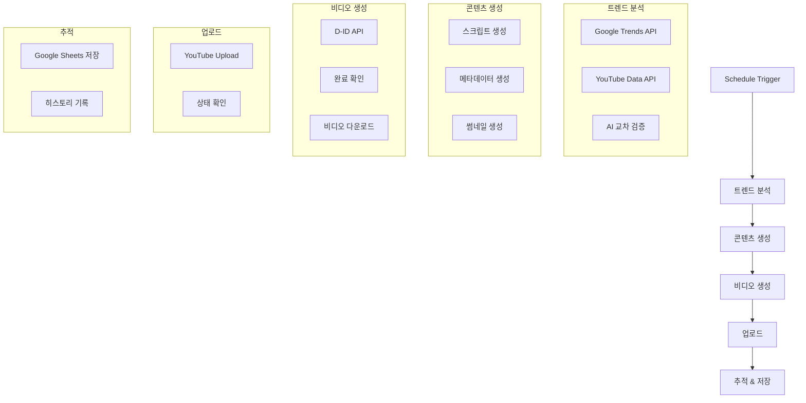

# YouTube Shorts Automation Workflow

> 📅 Created: 2025-11-22  
> 🎯 Purpose: Automated YouTube Shorts creation with trend analysis and auto-upload

---

## 워크플로우 개요

### 목적
유튜브 쇼츠용 시니어 건강 콘텐츠를 자동으로 생성하고 업로드하는 N8N 워크플로우

### 주요 기능
- 🔍 **트렌드 분석**: Google Trends + YouTube API를 통한 이중 소스 분석
- 🤖 **AI 콘텐츠 생성**: OpenAI GPT를 활용한 스크립트 및 메타데이터 생성
- 🎬 **비디오 제작**: D-ID API를 통한 AI 아바타 비디오 생성
- 📤 **자동 업로드**: YouTube API를 통한 자동 업로드
- 💾 **상태 관리**: Google Sheets를 통한 콘텐츠 추적 및 히스토리 관리

---

## 전체 워크플로우 구조



---

## 노드별 상세 설정

### 1️⃣ Schedule Trigger (스케줄 트리거)

**노드 타입**: `n8n-nodes-base.scheduleTrigger`

**설정값**:
- **Rule**: 매일 오전 9시 실행
- **Timezone**: Asia/Seoul (KST)
- **Mode**: Custom

```json
{
  "rule": {
    "interval": [{
      "field": "cronExpression",
      "expression": "0 9 * * *"
    }]
  },
  "timezone": "Asia/Seoul"
}
```

**용도**: 워크플로우를 매일 정해진 시간에 자동 실행

---

### 2️⃣ Google Trends Analysis (구글 트렌드 분석)

**노드 타입**: `n8n-nodes-base.httpRequest`

**주요 설정**:
- **Method**: GET
- **URL**: Google Trends API endpoint
- **Query Parameters**:
  - `geo`: KR (대한민국)
  - `category`: Health (건강)
  - `time`: now 7-d (최근 7일)

**응답 데이터**:
```json
{
  "trends": [
    {
      "keyword": "시니어 건강",
      "interest": 85,
      "related_queries": [...]
    }
  ]
}
```

---

### 3️⃣ YouTube Trends Fetcher (유튜브 트렌드 수집)

**노드 타입**: `n8n-nodes-base.youTube`

**설정**:
- **Resource**: Search
- **Operation**: List
- **Options**:
  - `q`: 시니어 건강, 노인 운동
  - `type`: video
  - `order`: viewCount
  - `publishedAfter`: 최근 7일
  - `maxResults`: 10
  - `videoDuration`: short (쇼츠)

**추출 데이터**:
- 비디오 제목
- 조회수
- 좋아요 수
- 댓글 수
- 키워드 태그

---

### 4️⃣ AI Cross-Validation (AI 교차 검증)

**노드 타입**: `n8n-nodes-base.openAi`

**모델**: `gpt-4-turbo`

**프롬프트 구조**:
```
당신은 시니어 건강 콘텐츠 전문가입니다.

다음 두 소스의 트렌드 데이터를 분석하세요:

Google Trends: {{ $json.googleTrends }}
YouTube Trends: {{ $json.youtubeTrends }}

다음 조건을 만족하는 최적의 주제를 선정하세요:
1. 60세+ 시니어에게 실질적으로 도움이 되는 내용
2. 쇼츠 형식(60초 이내)에 적합
3. 시각적으로 표현 가능한 운동/건강법
4. 안전하고 검증된 정보

JSON 형식으로 응답하세요:
{
  "topic": "선정된 주제",
  "reason": "선정 이유",
  "keywords": ["키워드1", "키워드2"],
  "safety_check": true/false
}
```

---

### 5️⃣ Script Generator (스크립트 생성기)

**노드 타입**: `n8n-nodes-base.openAi`

**모델**: `gpt-4-turbo`

**페르소나**: 보람 (따뜻하고 친근한 시니어 건강 가이드)

**프롬프트**:
```
페르소나: 보람 - 60대 여성, 전직 간호사, 따뜻하고 친근한 말투

주제: {{ $json.topic }}

60초 쇼츠용 스크립트를 작성하세요:

구조:
[00-10초] 후킹: 시선을 사로잡는 질문/문제 제기
[10-40초] 본론: 구체적인 방법 3가지 (각 10초)
[40-55초] 팁: 주의사항 또는 추가 팁
[55-60초] 클로징: 행동 유도 및 인사

말투:
- 존댓말 사용
- 따뜻하고 격려하는 톤
- 전문용어는 쉽게 풀어서 설명
- "우리 함께 해봐요" 스타일

JSON 응답:
{
  "script": "전체 스크립트",
  "sections": {
    "hook": "...",
    "main": ["방법1", "방법2", "방법3"],
    "tip": "...",
    "closing": "..."
  },
  "estimated_duration": 60
}
```

---

### 6️⃣ Metadata Generator (메타데이터 생성기)

**노드 타입**: `n8n-nodes-base.openAi`

**목적**: 제목, 설명, 태그, 해시태그 생성

**프롬프트**:
```
주제: {{ $json.topic }}
스크립트: {{ $json.script }}

유튜브 쇼츠용 최적화된 메타데이터를 생성하세요:

제목 요구사항:
- 40자 이내
- 숫자 포함 (예: 3가지 방법)
- 감탄사 또는 이모지 활용
- 클릭을 유도하는 후킹 요소

설명 요구사항:
- 3-5줄
- 핵심 내용 요약
- 행동 유도 (구독, 좋아요)
- 관련 영상 링크 가능

태그:
- 15-20개
- 관련성 높은 순서로 정렬
- 롱테일 키워드 포함

해시태그:
- 3-5개
- 트렌딩 해시태그 우선

JSON 응답:
{
  "title": "제목",
  "description": "설명",
  "tags": ["태그1", "태그2", ...],
  "hashtags": ["#해시태그1", "#해시태그2", ...]
}
```

---

### 7️⃣ Thumbnail Image Generator (썸네일 생성기)

**노드 타입**: `n8n-nodes-base.openAi` (DALL-E 3)

**설정**:
- **Model**: dall-e-3
- **Size**: 1024x1024 (이후 1080x1920으로 리사이즈)
- **Quality**: hd
- **Style**: natural

**프롬프트 템플릿**:
```
Create a warm and inviting thumbnail for a YouTube Short about: {{ $json.topic }}

Style:
- Soft, warm lighting
- Friendly senior woman (60s) doing the health activity
- Clean, uncluttered background
- Professional but approachable

Colors:
- Pastel tones (soft pink, light blue, cream)
- Avoid harsh contrasts
- Warm and comforting palette

Composition:
- Portrait orientation (9:16 ratio)
- Subject centered
- Clear focal point
- Large, readable text space

Text overlay (Korean):
Main: "{{ $json.title }}"
Font: Bold, sans-serif, high contrast

Extra elements:
- Small health icon (heart, leaf)
- Subtle gradient backdrop
```

---

### 8️⃣ D-ID Video Creator (AI 비디오 생성)

**노드 타입**: `n8n-nodes-base.httpRequest`

**API**: D-ID API v1

**Endpoint**: `POST /talks`

**요청 바디**:
```json
{
  "script": {
    "type": "text",
    "input": "{{ $json.script }}",
    "provider": {
      "type": "microsoft",
      "voice_id": "ko-KR-SunHiNeural"
    }
  },
  "source_url": "{{ $json.presenterId }}",
  "config": {
    "fluent": true,
    "pad_audio": 0,
    "stitch": true,
    "result_format": "mp4"
  },
  "driver_url": "bank://lively"
}
```

**응답**:
```json
{
  "id": "tlk_xxxxxxxxxxxx",
  "status": "created",
  "created_at": "2025-11-22T02:21:05.000Z"
}
```

---

### 9️⃣ D-ID Status Checker (비디오 생성 상태 확인)

**노드 타입**: `n8n-nodes-base.httpRequest`

**Method**: GET

**URL**: `https://api.d-id.com/talks/{{ $json.talkId }}`

**Loop Configuration**:
- **Maximum Retries**: 30
- **Retry Interval**: 10초
- **Success Condition**: `status === "done"`

**응답 (완료 시)**:
```json
{
  "id": "tlk_xxxxxxxxxxxx",
  "status": "done",
  "result_url": "https://d-id-talks-prod.s3.amazonaws.com/...",
  "duration": 58.5
}
```

---

### 🔟 Video Downloader (비디오 다운로드)

**노드 타입**: `n8n-nodes-base.httpRequest`

**설정**:
- **Method**: GET
- **URL**: `{{ $json.result_url }}`
- **Response Format**: File (Binary)
- **Download File Name**: `shorts_{{ $now.toFormat('yyyyMMdd_HHmmss') }}.mp4`

**저장 경로**: `/tmp/n8n/videos/`

---

### 1️⃣1️⃣ YouTube Uploader (유튜브 업로드)

**노드 타입**: `n8n-nodes-base.youTube`

**Resource**: Video

**Operation**: Upload

**주요 설정**:
```json
{
  "title": "{{ $json.metadata.title }}",
  "description": "{{ $json.metadata.description }}",
  "tags": "{{ $json.metadata.tags }}",
  "categoryId": "22",
  "privacyStatus": "public",
  "madeForKids": false,
  "thumbnail": "{{ $json.thumbnailUrl }}",
  "binaryData": true,
  "binaryPropertyName": "data"
}
```

**카테고리 ID**:
- 22 = People & Blogs
- Alternative: 26 = Howto & Style

---

### 1️⃣2️⃣ Google Sheets Logger (구글 시트 기록)

**노드 타입**: `n8n-nodes-base.googleSheets`

**Operation**: Append Row

**Spreadsheet**: `YouTube Shorts Tracker`

**Sheet Name**: `콘텐츠 히스토리`

**데이터 구조**:
| 날짜 | 주제 | 제목 | 비디오 ID | 조회수 | 좋아요 | 댓글 | 상태 |
|------|------|------|-----------|--------|--------|------|------|
| 2025-11-22 | 시니어 스트레칭 | ... | abc123 | 0 | 0 | 0 | Published |

**추가 컬럼** (메타정보):
- 트렌드 소스
- AI 모델 버전
- 생성 시간
- 업로드 시간

---

## 데이터 흐름

### Phase 1: 트렌드 수집 및 분석
```
Schedule Trigger
  ↓
[Google Trends API] → Trend Data 1
[YouTube Data API] → Trend Data 2
  ↓
[Merge + AI Analysis] → Selected Topic
```

### Phase 2: 콘텐츠 생성
```
Selected Topic
  ↓
[GPT-4: Script] → Full Script (60s)
  ↓
[GPT-4: Metadata] → Title, Description, Tags
  ↓
[DALL-E 3: Image] → Thumbnail PNG
```

### Phase 3: 비디오 제작
```
Script + Presenter ID
  ↓
[D-ID: Create Talk] → Talk ID
  ↓
[D-ID: Poll Status] → (Wait until done)
  ↓
[D-ID: Download] → MP4 File
```

### Phase 4: 업로드 및 추적
```
MP4 + Metadata + Thumbnail
  ↓
[YouTube: Upload] → Video ID
  ↓
[Google Sheets: Log] → Record Saved
```

---

## 환경 변수

워크플로우 실행에 필요한 환경 변수:

```bash
# OpenAI
OPENAI_API_KEY=sk-...

# D-ID
DID_API_KEY=...

# YouTube Data API
YOUTUBE_API_KEY=...
YOUTUBE_OAUTH_CLIENT_ID=...
YOUTUBE_OAUTH_CLIENT_SECRET=...

# Google Trends (unofficial)
GOOGLE_TRENDS_API_KEY=...

# Google Sheets
GOOGLE_SHEETS_API_KEY=...
GOOGLE_SHEETS_SPREADSHEET_ID=...

# D-ID Presenter
DID_PRESENTER_ID=...  # 보람 아바타 ID
```

---

## 성능 최적화

### 1. API 호출 최소화
- **배치 처리**: 가능한 경우 여러 요청을 묶어서 처리
- **캐싱**: 트렌드 데이터 1시간 캐싱
- **병렬 처리**: 독립적인 작업은 동시 실행

### 2. 비용 관리
- **모델 선택**: GPT-4 Turbo 사용 (비용 효율적)
- **토큰 최적화**: 프롬프트 길이 최소화
- **이미지 크기**: 필요한 최소 크기로 생성

### 3. 실행 시간
- **평균 실행 시간**: 8-12분
  - 트렌드 분석: 30초
  - 콘텐츠 생성: 2분
  - 비디오 생성: 5-8분
  - 업로드: 1-2분

---

*Documentation added by AI Assistant*  
*Last updated: 2025-11-22*
