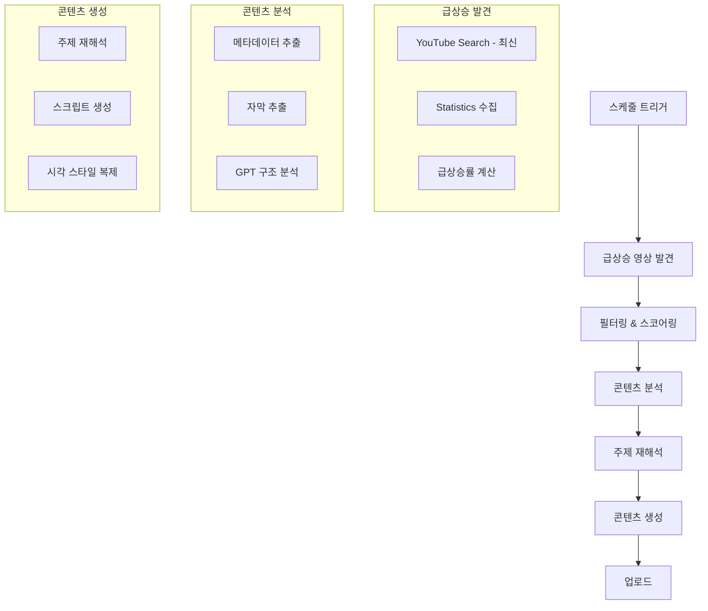

# 🔥 실시간 트렌드 감지 및 복제 전략

> 📅 작성일: 2025-11-22  
> 🎯 목표: 지금 막 뜨고 있는 유튜브 영상을 찾아서 자동으로 유사 콘텐츠 생성

---

## 🔍 문제 정의

### 기존 방식의 한계

| 현재 워크플로우 | 문제점 |
|----------------|--------|
| **YouTube mostPopular API** | 이미 뜬 영상 (늦음) |
| **Google Trends** | 키워드만 제공 (구체성 부족) |
| **Static Keywords** | 트렌드 변화 감지 불가 |
| **No Content Analysis** | 영상 내용을 모름 |

### 원하는 기능

✅ **급상승 감지**: 조회수가 빠르게 증가하는 영상 발견  
✅ **실시간 모니터링**: 24시간 이내 업로드된 영상 추적  
✅ **콘텐츠 분석**: 영상의 실제 내용, 구조, 스타일 파악  
✅ **자동 복제**: 같은 포맷으로 우리만의 버전 생성

---

## 💡 해결 방법: 3단계 전략

### Phase 1: 🔎 급상승 영상 발견

#### 방법 1: YouTube Data API v3 (고급 쿼리)

**기존 API vs 새로운 API**

```diff
# 기존 (형식적)
- chart=mostPopular
- publishedAfter=(없음)
+ order=viewCount

# 새로운 (급상승 감지)
+ order=date
+ publishedAfter=최근 24시간
+ 조회수/시간 비율 계산
+ 급상승률 기준으로 필터링
```

**구체적인 API 쿼리**

```javascript
// YouTube Data API v3 - Search
{
  part: "snippet",
  type: "video",
  order: "date",                    // 최신순
  publishedAfter: "2025-11-21T00:00:00Z",  // 24시간 이내
  regionCode: "KR",
  videoCategoryId: "26",            // Howto & Style
  maxResults: 50,
  
  // 추가 필터
  videoDuration: "short",           // Shorts만
  relevanceLanguage: "ko"
}

// 이후 각 영상의 통계 가져오기
// Videos API - statistics
{
  part: "statistics",
  id: "video_id_list"
}

// 급상승률 계산
const risingScore = (viewCount / hoursOld) * (likeCount / viewCount)
// 상위 10개 선택
```

#### 방법 2: 특정 채널 모니터링

**성공한 경쟁 채널들의 최신 영상 추적**

```javascript
// 모니터링할 채널 리스트
const targetChannels = [
  "UC_channel_id_1",  // 시니어 건강 성공 채널 1
  "UC_channel_id_2",  // 시니어 건강 성공 채널 2
  // ...
];

// 각 채널의 최신 영상 확인
for (const channelId of targetChannels) {
  const latestVideos = await youtube.search.list({
    part: "snippet",
    channelId: channelId,
    order: "date",
    publishedAfter: "24시간 전",
    maxResults: 3
  });
  
  // 각 영상의 초기 반응 체크
  // (조회수가 평소보다 높으면 = 뜨는 중)
}
```

#### 방법 3: YouTube Trending API (비공식)

```javascript
// 비공식 API 또는 스크래핑
// https://www.youtube.com/feed/trending?bp=4gIcGhpnYW1pbmdfY29ycHVzX21vc3RfcG9wdWxhcg%3D%3D

// 또는 RapidAPI 같은 서드파티 서비스
// Trending videos by region/category
```

---

### Phase 2: 📊 영상 콘텐츠 분석

#### 2-1. 메타데이터 추출

**YouTube Data API로 가져오기**

```javascript
// Videos API
{
  part: "snippet,contentDetails,statistics",
  id: "trending_video_id"
}

// 추출 정보:
{
  title: "...",
  description: "...",
  tags: [...],
  categoryId: "26",
  duration: "PT30S",        // 30초
  thumbnail: "url",
  viewCount: 50000,
  likeCount: 3000,
  commentCount: 150,
  publishedAt: "2025-11-21T10:00:00Z"
}
```

#### 2-2. 자막/트랜스크립트 추출

**YouTube Transcript API 사용**

```javascript
// Option 1: youtube-transcript (npm package)
const { YoutubeTranscript } = require('youtube-transcript');

const transcript = await YoutubeTranscript.fetchTranscript('video_id', {
  lang: 'ko'
});

// Output:
[
  { text: "안녕하세요", duration: 2.5, offset: 0 },
  { text: "오늘은 건강 팁을 알려드릴게요", duration: 3.0, offset: 2.5 },
  ...
]
```

```javascript
// Option 2: YouTube Data API - Captions
// (API 키로는 직접 불가, OAuth 필요)

// Option 3: 자막 파일 직접 다운로드 (공개된 경우)
const subtitleUrl = `https://www.youtube.com/api/timedtext?v=${videoId}&lang=ko`;
```

#### 2-3. 썸네일 분석 (선택적)

```javascript
// GPT-4 Vision으로 썸네일 분석
const thumbnailAnalysis = await openai.chat.completions.create({
  model: "gpt-4-vision-preview",
  messages: [
    {
      role: "user",
      content: [
        {
          type: "text",
          text: "이 유튜브 썸네일의 스타일을 분석하세요: 색상, 텍스트 위치, 인물 표정, 디자인 요소"
        },
        {
          type: "image_url",
          image_url: {
            url: thumbnailUrl
          }
        }
      ]
    }
  ]
});
```

#### 2-4. GPT로 콘텐츠 구조 분석

```javascript
// 전체 메타데이터 + 자막을 GPT에게 분석시키기
const contentAnalysis = await openai.chat.completions.create({
  model: "gpt-4o",
  messages: [
    {
      role: "system",
      content: `당신은 유튜브 쇼츠 콘텐츠 분석 전문가입니다.

다음 정보를 바탕으로 영상의 핵심 요소를 분석하세요:

1. **주제**: 영상이 다루는 핵심 주제
2. **구조**: Hook-Content-CTA 분석
3. **톤앤매너**: 말투, 분위기
4. **시각적 요소**: 색상, 텍스트 스타일
5. **차별점**: 왜 이 영상이 뜨고 있는지

JSON 응답:
{
  "topic": "주제",
  "hook": "첫 3초 훅 방식",
  "structure": ["단계1", "단계2", ...],
  "tone": "밝고 경쾌함",
  "visual_style": "파스텔 톤, 큰 텍스트",
  "success_factor": "왜 뜨는지"
}`
    },
    {
      role: "user",
      content: `제목: ${video.title}
설명: ${video.description}
태그: ${video.tags.join(', ')}
자막:
${transcript.map(t => t.text).join('\n')}`
    }
  ],
  response_format: { type: "json_object" }
});
```

---

### Phase 3: 🎨 유사 콘텐츠 자동 생성

#### 3-1. 주제 재해석

**원본 영상의 주제를 우리 페르소나에 맞게 변환**

```javascript
// GPT로 주제 재해석
const adaptedTopic = await openai.chat.completions.create({
  model: "gpt-4o",
  messages: [
    {
      role: "system",
      content: `원본 영상의 주제를 "보람이" 페르소나에 맞게 재해석하세요.

보람이 특징:
- 5살 손녀
- 할머니를 걱정하는 귀여운 어린이
- 시니어 건강에 특화

원본 주제를 유지하되, 보람이만의 방식으로 변환하세요.`
    },
    {
      role: "user",
      content: `원본 분석:
${JSON.stringify(contentAnalysis, null, 2)}

이 주제를 보람이 버전으로 재해석하세요.`
    }
  ]
});
```

#### 3-2. 스크립트 생성 (구조 복제)

**원본 영상의 구조를 따라하되 내용은 우리 것**

```javascript
const script = await openai.chat.completions.create({
  model: "gpt-4o",
  messages: [
    {
      role: "system",
      content: `원본 영상의 구조를 정확히 따라서 "보람이" 버전 스크립트를 작성하세요.

구조:
${contentAnalysis.structure.map((s, i) => `${i+1}. ${s}`).join('\n')}

톤앤매너:
${contentAnalysis.tone}

각 섹션마다 원본과 같은 시간 배분으로 작성하세요.`
    },
    {
      role: "user",
      content: `주제: ${adaptedTopic}

6문장 스크립트 작성 (각 40자 이내)`
    }
  ]
});
```

#### 3-3. 시각적 스타일 복제

**원본 썸네일/영상 스타일을 DALL-E로 재현**

```javascript
// 썸네일 프롬프트 자동 생성
const thumbnailPrompt = await openai.chat.completions.create({
  model: "gpt-4o",
  messages: [
    {
      role: "system",
      content: `원본 영상의 시각적 스타일을 DALL-E 프롬프트로 변환하세요.

원본 스타일:
${contentAnalysis.visual_style}

보람이 캐릭터(5살 한국 여자아이, 의사 가운)를 포함하되, 
원본의 색상/레이아웃/분위기를 유지하세요.`
    }
  ]
});

// DALL-E로 생성
const image = await openai.images.generate({
  model: "dall-e-3",
  prompt: thumbnailPrompt,
  size: "1024x1024"
});
```

---

## 🏗️ 완전한 N8N 워크플로우 설계

### 전체 구조



### 노드 구성 (20개)

| # | 노드 이름 | 타입 | 기능 |
|---|----------|------|------|
| 1 | 스케줄 트리거 | scheduleTrigger | 매 6시간마다 실행 |
| 2 | 최신 영상 수집 | httpRequest | YouTube Search API (최신 50개) |
| 3 | 통계 수집 | httpRequest | YouTube Videos API (조회수, 좋아요) |
| 4 | 급상승률 계산 | code | 조회수/시간 비율 계산 |
| 5 | Top 5 선택 | code | 급상승률 상위 5개 |
| 6 | 자막 추출 | httpRequest | YouTube Transcript API |
| 7 | 메타데이터 파싱 | code | 제목, 설명, 태그 정리 |
| 8 | GPT 콘텐츠 분석 | openAi | 영상 구조/스타일 분석 |
| 9 | 주제 재해석 | openAi | 보람이 버전으로 변환 |
| 10 | 스크립트 생성 | openAi | 구조 복제 스크립트 |
| 11 | 대본 6분할 | code | 6문장 분할 |
| 12 | 이미지 생성 | openAi | DALL-E (스타일 복제) |
| 13 | 오디오 생성 | openAi | TTS |
| 14 | Drive 백업 | googleDrive | 자산 저장 |
| 15 | 자산 병합 | merge | 이미지+오디오 |
| 16 | 렌더링 | httpRequest | Creatomate |
| 17 | 다운로드 | httpRequest | 비디오 다운로드 |
| 18 | 업로드 | youTube | YouTube 업로드 |
| 19 | 원본 영상 기록 | googleSheets | 어떤 영상을 참고했는지 기록 |
| 20 | 성과 추적 | googleSheets | 우리 영상 성과 |

---

## 📊 급상승 감지 알고리즘

### JavaScript 코드 (노드 4)

```javascript
// 급상승률 계산 알고리즘
const videos = $json.items;

const scoredVideos = videos.map(video => {
  const publishedAt = new Date(video.snippet.publishedAt);
  const now = new Date();
  const hoursOld = (now - publishedAt) / (1000 * 60 * 60);
  
  // 통계 (노드 3에서 가져온 데이터)
  const stats = video.statistics;
  const viewCount = parseInt(stats.viewCount) || 0;
  const likeCount = parseInt(stats.likeCount) || 0;
  const commentCount = parseInt(stats.commentCount) || 0;
  
  // 급상승 점수 계산
  const viewsPerHour = viewCount / Math.max(hoursOld, 1);
  const engagementRate = (likeCount + commentCount * 2) / Math.max(viewCount, 1);
  const risingScore = viewsPerHour * (1 + engagementRate * 10);
  
  return {
    ...video,
    hoursOld: hoursOld.toFixed(1),
    viewsPerHour: viewsPerHour.toFixed(0),
    engagementRate: (engagementRate * 100).toFixed(2) + '%',
    risingScore: risingScore.toFixed(0)
  };
});

// 급상승 점수 기준으로 정렬
scoredVideos.sort((a, b) => b.risingScore - a.risingScore);

// 상위 5개만 선택 (너무 많으면 API 비용 증가)
const top5 = scoredVideos.slice(0, 5);

return top5.map(v => ({ json: v }));
```

---

## 🎯 실전 예시

### 시나리오: 급상승 영상 발견 → 복제

#### 1️⃣ 발견된 영상

```json
{
  "videoId": "abc123",
  "title": "60대도 쉽게! 앉아서 하는 무릎 스트레칭 3분",
  "channelTitle": "건강박사TV",
  "viewCount": 50000,
  "hoursOld": 8,
  "viewsPerHour": 6250,
  "risingScore": 12500,
  "transcript": [
    "무릎 아프신 분들 주목하세요!",
    "의자에 앉아서 할 수 있는 초간단 스트레칭",
    "첫 번째, 발끝을 천천히 위로",
    "두 번째, 무릎을 쭉 펴기",
    "세 번째, 10초 유지!",
    "매일 하면 무릎 통증 확 줄어요"
  ]
}
```

#### 2️⃣ AI 분석 결과

```json
{
  "topic": "무릎 통증 완화 스트레칭",
  "hook": "증상 공감 + 놀라움",
  "structure": [
    "문제 제기 (무릎 통증)",
    "해결책 소개",
    "3단계 동작 설명",
    "효과 보장"
  ],
  "tone": "친절하고 격려하는",
  "visual_style": "파스텔 블루, 큰 텍스트, 동작 일러스트",
  "success_factor": "간단하고 즉시 따라할 수 있음 + 시니어 타겟 명확"
}
```

#### 3️⃣ 보람이 버전 생성

**재해석된 주제**:
"할머니 무릎 아플 때 보람이가 알려주는 앉아서 하는 스트레칭"

**생성된 스크립트** (구조 복제):
```
1. 할머니~ 무릎이 아프시죠? 보람이가 도와드릴게요!
2. 의자에 앉아서 할 수 있는 정말 쉬운 방법이 있어요!
3. 첫 번째! 발끝을 천천히 천장을 향해 올려요
4. 두 번째! 무릎을 쭉쭉 펴주세요
5. 세 번째! 10초 동안 그대로 있어요
6. 매일 하시면 무릎이 튼튼해져요! 사랑해요 할머니!
```

**생성된 이미지 프롬프트** (스타일 복제):
```
Pixar style 3D animation, cute 5-year-old Korean girl in white doctor coat,
soft pastel blue background, large Korean text overlay,
demonstration of knee stretching exercise,
warm lighting, friendly atmosphere,
illustration icons showing exercise steps
```

---

## 💰 비용 분석

### 기존 방식 vs 새로운 방식

| 항목 | 기존 | 새 방식 | 차이 |
|------|------|---------|------|
| **YouTube API 호출** | 1회 | 3회 (Search + Videos + Transcript) | +2회 |
| **GPT-4o 호출** | 3회 | 5회 (분석 + 재해석 + 스크립트 + 이미지프롬프트 + 메타) | +2회 |
| **DALL-E** | 6장 | 6장 | 동일 |
| **TTS** | 6개 | 6개 | 동일 |
| **총 비용/회** | ~$0.45 | ~$0.55 | +$0.10 |

**추가 비용 대비 효과**:
- ✅ 실시간 트렌드 감지 (늦지 않음)
- ✅ 검증된 포맷 복제 (성공 확률 높음)
- ✅ 콘텐츠 품질 향상

---

## 🛠️ 추가 최적화 아이디어

### 1. 채널 화이트리스트

**성공한 경쟁 채널만 모니터링**

```javascript
// 모니터링 대상 채널 리스트
const whitelistChannels = [
  { id: "UC...", name: "건강박사TV", avg_views: 50000 },
  { id: "UC...", name: "시니어건강연구소", avg_views: 30000 },
  // ...
];

// 이 채널들의 최신 영상만 체크
// → API 호출 최소화, 품질 보장
```

### 2. 블랙리스트 (중복 방지)

```javascript
// 이미 참고한 영상은 제외
const blacklist = await getFromSheets('referenced_videos');

const newVideos = allVideos.filter(v => 
  !blacklist.includes(v.videoId)
);
```

### 3. 카테고리별 전략

```json
{
  "시니어 건강": {
    "keywords": ["무릎", "관절", "스트레칭"],
    "target_channels": ["UC...", "UC..."],
    "min_rising_score": 5000
  },
  "요리/레시피": {
    "keywords": ["간단", "레시피", "시니어"],
    "target_channels": ["UC...", "UC..."],
    "min_rising_score": 10000
  }
}
```

### 4. 실시간 알림

**급상승 영상 발견 시 즉시 알림**

```javascript
// Slack 또는 이메일 알림
if (risingScore > 10000) {
  await slack.send({
    channel: "#trending-alert",
    text: `🔥 급상승 영상 발견!\n제목: ${video.title}\n조회수/시간: ${viewsPerHour}\n링크: https://youtube.com/watch?v=${video.videoId}`
  });
}
```

---

## 📈 성과 측정

### 추적할 메트릭

| 메트릭 | 목적 |
|--------|------|
| **발견 → 업로드 시간** | 얼마나 빨리 트렌드를 따라잡는지 |
| **원본 vs 우리 조회수 비율** | 복제 효과 측정 |
| **급상승 점수 vs 최종 성과** | 알고리즘 정확도 |
| **카테고리별 성공률** | 어떤 주제가 잘 되는지 |

### Google Sheets 구조

| 날짜 | 원본_영상_ID | 원본_제목 | 원본_조회수 | 급상승점수 | 우리_영상_ID | 우리_조회수 | 복제_효과 | 업로드_지연시간 |
|------|-------------|----------|------------|----------|------------|----------|----------|---------------|
| 2025-11-22 | abc123 | ... | 50,000 | 12,500 | xyz789 | 3,000 | 6% | 4시간 |

---

## 🚀 다음 단계

### 즉시 실행 가능

1. **YouTube Transcript API 테스트**
   ```bash
   npm install youtube-transcript
   node test_transcript.js
   ```

2. **급상승 알고리즘 검증**
   - 수동으로 최근 24시간 영상 확인
   - 계산식 검증

3. **프로토타입 워크플로우 구축**
   - 노드 1-10까지만 먼저
   - 급상승 감지 → 분석까지만

### 장기 로드맵

- **1주차**: 급상승 감지 + 분석 완성
- **2주차**: 콘텐츠 생성 자동화 연결
- **3주차**: 성과 측정 및 알고리즘 튜닝
- **4주차**: 다중 카테고리 확장

---

*문서 작성: AI Assistant*  
*최종 업데이트: 2025-11-22 12:38 KST*
