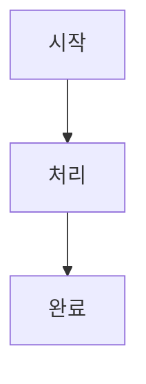

# N8N Copilot 문서 구조 사용 가이드 (한국어)

> 📅 작성일: 2025-11-22  
> 🎯 목적: N8N 문서 저장소 사용 방법 및 관리 가이드

---

## 📁 전체 구조 한눈에 보기

```
n8n-copilot/
├── docs/                           # 📚 모든 문서가 여기에
│   ├── workflows/                  # 워크플로우 문서
│   │   ├── marketing/             # 마케팅 자동화 (YouTube, SNS, 광고)
│   │   ├── sales/                 # 영업 자동화 (리드 생성, CRM)
│   │   ├── operations/            # 운영 자동화 (데이터 처리, 리포트)
│   │   ├── ai_agents/             # AI 에이전트 (챗봇, 분석)
│   │   └── integrations/          # API 연동 가이드
│   │
│   ├── guides/                     # 학습 가이드
│   │   ├── getting_started/       # 초보자용
│   │   ├── intermediate/          # 중급자용
│   │   └── advanced/              # 고급 주제
│   │
│   ├── reference/                  # 참고 자료
│   │   ├── nodes/                 # 노드 설명서
│   │   ├── apis/                  # API 가이드
│   │   └── best_practices/        # 모범 사례
│   │
│   └── case_studies/              # 실전 사례
│
├── templates/                      # 🎨 바로 쓸 수 있는 JSON 파일
│   ├── marketing/
│   ├── sales/
│   └── ai_agents/
│
├── examples/                       # 💡 예제 프로젝트
│   ├── beginner/                  # 초급
│   ├── intermediate/              # 중급
│   └── advanced/                  # 고급
│
├── assets/                         # 🖼️ 이미지, 영상 등
│   └── images/
│
└── scripts/                        # 🔧 자동화 도구
    └── generate_index.py          # 인덱스 자동 생성
```

---

## 🎯 어떻게 사용하나요?

### 1️⃣ 워크플로우 찾기

#### 목적별로 찾기
```
YouTube 자동화 찾기:
→ docs/workflows/marketing/youtube_automation.md

리드 생성 찾기:
→ docs/workflows/sales/lead_generation.md

AI 챗봇 만들기:
→ docs/workflows/ai_agents/customer_support.md
```

#### 난이도별로 찾기
```
초보자:
→ examples/beginner/ 폴더 확인

중급자:
→ examples/intermediate/ 폴더 확인

고급:
→ examples/advanced/ 폴더 확인
```

### 2️⃣ 새 워크플로우 추가하기

#### 단계별 가이드

**1단계: 카테고리 결정**
```
마케팅 관련? → docs/workflows/marketing/
영업 관련? → docs/workflows/sales/
AI 에이전트? → docs/workflows/ai_agents/
운영/데이터? → docs/workflows/operations/
API 연동? → docs/workflows/integrations/
```

**2단계: 파일 생성**
```
파일명 규칙:
{카테고리}_{구체적_주제}_{버전}.md

예시:
- marketing_instagram_automation_v1.md
- sales_email_campaign_v2.md
- ai_content_writer_v1.md
```

**3단계: 메타데이터 추가**
```yaml
---
title: 워크플로우 이름
category: Marketing
subcategory: Social Media
difficulty: Intermediate
cost: $0.50/실행
time: 5분
apis:
  - OpenAI
  - Instagram API
tags:
  - instagram
  - automation
  - social-media
version: 1.0
last_updated: 2025-11-22
description: 간단한 설명 한 줄
---
```

**4단계: 내용 작성**
```markdown
# 워크플로우 제목

## 개요
무엇을 하는 워크플로우인지 설명

## 전체 흐름


## 핵심 노드
| 노드 | 용도 |
|------|------|
| Trigger | 시작점 |
| OpenAI | AI 처리 |

## 설정 방법
1. 첫 번째 단계
2. 두 번째 단계
3. 세 번째 단계

## 사용 예시
실제 사용 사례

## 문제 해결
자주 묻는 질문
```

**5단계: JSON 템플릿 추가 (선택)**
```
templates/{카테고리}/{워크플로우명}_v1.json
```

**6단계: 인덱스 업데이트**
```bash
# 자동 업데이트
python scripts/generate_index.py

# 또는 수동으로 README.md 수정
```

---

## 🔍 빠른 검색 방법

### 키워드로 찾기

| 찾고 싶은 것 | 어디서 찾나요? |
|------------|-------------|
| YouTube 자동화 | `docs/workflows/marketing/` |
| 리드 생성 | `docs/workflows/sales/` |
| 챗봇 만들기 | `docs/workflows/ai_agents/` |
| 데이터 처리 | `docs/workflows/operations/` |
| OpenAI 사용법 | `docs/reference/apis/openai.md` |
| 기초 노드 | `docs/reference/nodes/essential_18_nodes.md` |
| 보안 설정 | `docs/reference/best_practices/security_compliance.md` |

### 비용별로 찾기

```
무료 워크플로우:
→ 각 README.md에서 "Cost: Free" 검색

저렴한 워크플로우 ($0.10 이하):
→ 각 README.md 테이블 확인

고비용 워크플로우:
→ 비용 컬럼 정렬해서 확인
```

---

## 📝 문서 작성 팁

### 좋은 문서의 조건

✅ **명확한 제목**
```
❌ 나쁜 예: "자동화"
✅ 좋은 예: "YouTube Shorts 자동 생성 및 업로드"
```

✅ **구체적인 비용/시간**
```
❌ 나쁜 예: "저렴함"
✅ 좋은 예: "$1.50/영상, 10분 소요"
```

✅ **실전 예시 포함**
```
이론만 X
→ 실제 사용 사례 + 스크린샷 포함
```

✅ **문제 해결 섹션**
```
자주 발생하는 에러와 해결 방법 포함
```

### 메타데이터 작성 가이드

```yaml
# 난이도 기준
Beginner: 노드 5개 이하, API 1-2개
Intermediate: 노드 10개 이하, API 3-5개
Advanced: 복잡한 로직, 여러 API 연동

# 비용 계산
API 호출 비용 × 예상 호출 횟수
예: OpenAI $0.002/1K tokens × 500 tokens = $0.001

# 시간 측정
실제 실행 시간 측정 (평균값)
```

---

## 🔧 자동화 도구 사용법

### generate_index.py 스크립트

**기능:**
- 모든 마크다운 파일 스캔
- YAML 메타데이터 추출
- README.md 자동 생성

**사용법:**
```bash
# 테스트 실행 (실제 변경 안 함)
python scripts/generate_index.py --dry-run

# 실제 실행
python scripts/generate_index.py
```

**자동 생성되는 것:**
- 워크플로우 테이블
- 난이도별 정렬
- 비용/시간 정보
- 링크 자동 생성

---

## 📊 폴더별 용도

### docs/workflows/

| 폴더 | 용도 | 예시 |
|------|------|------|
| `marketing/` | 마케팅 자동화 | YouTube, SNS, 광고 |
| `sales/` | 영업 자동화 | 리드 생성, 이메일 |
| `operations/` | 운영 자동화 | 데이터 처리, 리포트 |
| `ai_agents/` | AI 에이전트 | 챗봇, 분석 |
| `integrations/` | API 연동 | Google, Slack 등 |

### docs/guides/

| 폴더 | 대상 | 내용 |
|------|------|------|
| `getting_started/` | 초보자 | 설치, 첫 워크플로우 |
| `intermediate/` | 중급자 | 데이터 변환, API |
| `advanced/` | 고급자 | 커스텀 노드, 최적화 |

### docs/reference/

| 폴더 | 용도 | 내용 |
|------|------|------|
| `nodes/` | 노드 설명 | 18개 필수 노드 |
| `apis/` | API 가이드 | OpenAI, Google 등 |
| `best_practices/` | 모범 사례 | 보안, 성능, 테스트 |

---

## 🎨 템플릿 사용법

### JSON 템플릿 가져오기

**1단계: 템플릿 찾기**
```
templates/marketing/youtube_shorts_v2.json
templates/sales/lead_generation_v1.json
templates/ai_agents/customer_support_v3.json
```

**2단계: n8n에 가져오기**
```
1. n8n 대시보드 열기
2. "+" 버튼 클릭
3. "Import from File" 선택
4. JSON 파일 선택
5. 가져오기 완료
```

**3단계: 설정 변경**
```
1. API 키 입력
2. 트리거 조건 수정
3. 데이터 매핑 확인
4. 테스트 실행
```

**4단계: 배포**
```
1. 워크플로우 활성화
2. 실행 로그 모니터링
3. 필요시 최적화
```

---

## 💡 실전 활용 예시

### 시나리오 1: YouTube 자동화 찾기

```
1. docs/workflows/marketing/ 폴더 열기
2. youtube_automation.md 파일 열기
3. 메타데이터 확인:
   - 비용: $1.50/영상
   - 시간: 10분
   - 난이도: Intermediate
4. 필요한 API 확인:
   - OpenAI
   - D-ID
   - YouTube Data API
5. templates/marketing/youtube_shorts_v2.json 다운로드
6. n8n에 가져오기
7. API 키 설정
8. 테스트 실행
```

### 시나리오 2: 새 워크플로우 추가

```
1. 카테고리 결정: AI 에이전트
2. 파일 생성: docs/workflows/ai_agents/blog_writer_v1.md
3. 메타데이터 작성:
   ---
   title: AI 블로그 작성 에이전트
   category: AI Agents
   difficulty: Intermediate
   cost: $0.50/글
   time: 5분
   apis: [OpenAI]
   tags: [blog, content, ai]
   version: 1.0
   ---
4. 내용 작성 (개요, 흐름, 노드, 설정)
5. JSON 템플릿 저장: templates/ai_agents/blog_writer_v1.json
6. 인덱스 업데이트: python scripts/generate_index.py
7. Git 커밋: git add . && git commit -m "Add blog writer agent"
```

### 시나리오 3: 문서 검색

```
# 키워드 검색 (VS Code)
Ctrl+Shift+F → "lead generation" 검색

# 파일명 검색
Ctrl+P → "youtube" 입력

# 폴더 탐색
docs/workflows/ → 카테고리별 확인
```

---

## 🚀 빠른 참조

### 자주 쓰는 명령어

```bash
# 새 폴더 생성
mkdir docs/workflows/새카테고리

# 파일 복사
cp template.md docs/workflows/marketing/새파일.md

# 인덱스 생성
python scripts/generate_index.py

# Git 커밋
git add .
git commit -m "Add new workflow"
git push
```

### 자주 가는 경로

```
📚 문서 허브: docs/README.md
🎨 템플릿: templates/README.md
💡 예제: examples/
🔧 스크립트: scripts/
```

### 유용한 링크

- [프로젝트 README](../README.md)
- [마케팅 워크플로우](docs/workflows/marketing/README.md)
- [영업 워크플로우](docs/workflows/sales/README.md)
- [AI 에이전트](docs/workflows/ai_agents/README.md)
- [필수 18 노드](docs/reference/nodes/essential_18_nodes.md)

---

## ❓ 자주 묻는 질문

### Q1: 새 워크플로우를 어디에 추가하나요?
**A:** 카테고리에 맞는 `docs/workflows/{카테고리}/` 폴더에 추가하세요.

### Q2: 메타데이터는 꼭 써야 하나요?
**A:** 네! 자동 인덱스 생성과 검색을 위해 필수입니다.

### Q3: JSON 템플릿은 어떻게 만드나요?
**A:** n8n에서 워크플로우 완성 후 "Export" → JSON 파일 저장 → `templates/` 폴더에 추가

### Q4: 인덱스는 언제 업데이트하나요?
**A:** 새 파일 추가 후 `python scripts/generate_index.py` 실행

### Q5: 한국어로 써도 되나요?
**A:** 네! 내용은 한국어, 메타데이터는 영어로 작성하세요.

---

## 📞 도움이 필요하면?

1. **문서 확인**: `docs/guides/getting_started/`
2. **예제 참고**: `examples/beginner/`
3. **기존 워크플로우 참고**: `docs/workflows/`

---

*이 가이드는 계속 업데이트됩니다*  
*마지막 업데이트: 2025-11-22* 🚀
